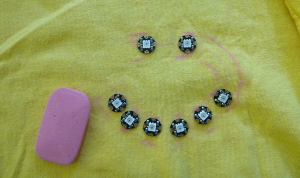

## غرزة دائرتك

+ اجمع كل NeoPixels وبعض الطباشير أو قلم رصاص. ضع تي شيرت \ (أو أي قطعة قماش التي تقوم بمشروعك عليها \) على سطح مستو.

+ رتب وحدات البكسل في الشكل الذي يعجبك. سأقوم بعمل وجه مبتسم! بعض الأفكار الأخرى هي:
  + خط مستقيم
  + القلب (ثمانية وحدات NeoPixels مثالية لهذا)
  + تظاهر "الأزرار" أسفل مقدمة القميص
  + نمط عشوائي

+ حدد المكان الذي تخطط للحصول على فلورا(شكل زهرة) فيه تقريبًا ، واختر NeoPixel ليتم توصيله به: سيكون هذا هو أول جهاز تقوم بخياطته. وسيتم توصيل البقية ببعضهم البعض في سلسلة.

+ احسب الترتيب الذي ستخيط به NeoPixels: يجب أن تكون قادرًا على تتبع مسار مستمر من الأول إلى الأخير بإصبعك بحيث لا يتخطى نفسه \ (قد يتسبب هذا في مشاكل مس كهربائيي short circuit!\).

+ ارسم حول هذا المسار بالقلم الرصاص أو الطباشير ، مع تحديد المكان الذي يوجد فيه كل NeoPixel.

### لنبدأ الخياطة!

+ بمجرد الانتهاء من وضع علامة على كل شيء ، ضع كل القطع جانبًا وامسك بإبرة وخيط موصل. يجب أن يكون حوالي 20 سم كافيًا للبدء إذا كانت وحدات البكسل متقاربة إلى حد ما. إذا كان لديك حلقة تطريز ، فإن استخدامها يمكن أن يجعل الخياطة أسهل بكثير.

ستخيط بيانات السطر الأول. هذا هو الخيط الذي يحمل التعليمات (الكود الخاص بك!) الذي يخبر NeoPixels بما يجب فعله ، مثل متى يضيء.

+ خذ NeoPixel الأول وضعه في مكانه ، مع توجيه الأسهم الصغيرة نحو المكان التالي. اربطه بالقماش عن طريق الخياطة عبر الفتحة باستخدام السهم الذي يشير إلى من LED في المنتصف. هذه الفتحة هي دبوس الإخراج.

--- collapse ---
---
title: ثقوب أو دبابيس؟
---

على لوحات مثل Adafruit Flora أو Arduino أو Raspberry Pi ، تُسمى الأجزاء المعدنية الصغيرة التي تستخدمها لربطها بالدائرة الكهربائية دبابيس.

في حالة يمكن ارتداؤها الإلكترونيات ، فإن الدبابيس ليست على شكل دبابيس على الرغم من أنها: لها شكل ثقب ، بحيث يمكنك توصيلها بخيوط موصلة. وهذا يعني أنه في مشاريع الأجهزة القابلة للارتداء ، يمكن أن تعني الكلمتان "دبوس" و "ثقب" الشيء نفسه.

--- /collapse ---

+ تأكد من إجراء اتصال آمن عن طريق خياطة غرزتين أو ثلاث بإحكام من خلال الثقب.

+ قم بخياطة غرزة قابلة للتنفيذ في المكان الذي ستذهب إليه NeoPixel التالية.

+ ثم خذ البكسل التالي وضعه في مكانه ، مع توجيه الأسهم بعيدًا عن النقطة الأولى ونحو البقعة التالية. قم بتثبيته عن طريق الخياطة من خلال إدخال الحفرة \ (تذكر ، هذه الحفرة مع السهم الذي يشير نحوه الصمام في الوسط \).

+ قم بتأمين الخيط ببعض الغرز في الجزء الخلفي من القماش وقص ما تبقى من مدى قصير.

--- collapse ---
---
title: حماية النهايات
---

من الجيد تغطية أطراف الخيط بطلاء أظافر واضح بعد القطع ، لمنع التآكل وتجنب الخيوط الضالة من التسبب في تماس كهربائي short circuit.

--- /collapse ---

+ باستخدام قطعة جديدة من الخيط موصل ، قم بتوصيل الإخراج ثقب NeoPixel الثاني لإدخال ثقب البكسل الثالث. استمر بهذه الطريقة حتى يتم ربط جميع وحدات NeoPixels معًا على طول بيانات الخاصة بها ثقوب ، مع قطعة منفصلة من الخيط تعمل بين كل زوج. تنتهي السلسلة بآخر NeoPixel: لا تعلق أي شيء على ناتج الخاص بها الفجوة.

بعد ذلك ستقوم بتوصيل كل السلبية ثقوب في السلسلة ، ثم كل موجبة منها.

+ باستخدام قطعة واحدة طويلة من الخيط( سلك) الموصل ، حوالي 50-100 سم ، قم بخياطة بعض الغرز الضيقة عبر **-** حفرة لكل بكسل ، بدءًا من الأولى وانتهاءً بالآخر ، وخياطة غرزة جارية بين NeoPixels.

**ملاحظة**: تأكد من أن مؤشر الترابط لا يلمس أو يتقاطع مع أي من مؤشرات الترابط في بيانات خط!

+ مع قطعة واحدة طويلة من الخيط(سلك) الموصل ، قم بتوصيل كل **+** ثقوب NeoPixels بنفس طريقة توصيلك لـ **-** ثقوب.

+ أخيرًا ، ضع لوحة فلورا على القميص \ (تأكد من أنها غير موصولة! \).

+ باستخدام ثلاثة منفصلة قطع خيط موصل ، قم بتوصيل اللوحة **\ # 6** حفرة لمدخل ثقب NeoPixel الأول ، GND للوحة حفرة **-** حفرة من NeoPixel الأول ، و VBATT للوحة حفرة ل **+** حفرة NeoPixel الأولى ، وخياطة غرزة جارية على طول النسيج. تأكد من عدم تلامس أي من الخيوط مع بعضها البعض.

+ إذا كنت ترغب في ذلك ، يمكنك خياطة بعض دبابيس فلورا غير المستخدمة في القميص مع بعض الخيوط البسيطة لإبقائها في مكان أكثر أمانًا.

+ الآن ، لحظة الحقيقة: قم بتوصيل فلورا.

يجب أن ترى كل NeoPixels تضيء!

--- collapse ---
---
title: هناك خطأ ما
---

إذا لم تضيء بعض وحدات NeoPixels ، فلا داعي للذعر. قد تكون بعض الأسباب:

+ تماس كهربائي short circuit.: هل يلامس أي من الخيوط؟ هل يوجد أي شيء معدني على القماش أو لمس الدائرة؟ هل القماش مبلل؟

+ وصلات فضفاضة: يجب أن تكون الغرز في كل حفرة جيدة وضيقة لاتصال آمن.

+ تم تحميل الكود البرمجي الصحيح: هل يحتوي الكود الخاص بك على العدد الصحيح من وحدات NeoPixels المحددة؟ هل تم تجميعها وتحميلها بدون أخطاء؟

--- /collapse --- 
