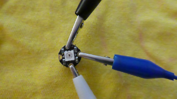

## Teste deine LED's

Bevor du beginnst, solltest du alle deine NeoPixel testen.

+ Öffne die Arduino IDE. Stelle sicher, dass du im Menü **Werkzeuge** das richtige Gerät ausgewählt hast. Ich benutze die Flora, also ist es für mich **Adafruit Flora**.

+ Gehe zum Menü **Datei**, wähle **Beispiele** aus, finde dann **Adafruit NeoPixel** (es kann ganz sehr weit unten sein!) und wähle **strandtest**.

Eine Codedatei wird geöffnet. Eine Codedatei wird in der Arduino IDE als **Sketch** (auf Deutsch: Skizze) bezeichnet.

+ Suche diese Codezeile weit oben:

```
  Adafruit_NeoPixel strip = Adafruit_NeoPixel(60, PIN, NEO_GRB + NEO_KHZ800);
```

+ Ändere die erste Zahl auf `1`. Dein Code sollte so aussehen:

  ```
    Adafruit_NeoPixel strip = Adafruit_NeoPixel(1, PIN, NEO_GRB + NEO_KHZ800);
  ```

+ Klicke auf **Datei** und dann auf **Speichern unter...** oder verwende die Tastenkombination Strg+Umschalt+S. Gib einen Namen für deine Skizze ein und klicke dann auf **Speichern**.

+ Klicke oben in deiner Skizze auf das Häkchen, um den Code zu **Überprüfen**. Am unteren Rand des Fensters sollten die Wörter "Kompilieren abgeschlossen" angezeigt werden, was bedeutet, dass der Code erfolgreich **kompiliert** wurde (wenn nicht, werden hier Fehler angezeigt. Um dies zu beheben, musst du einige Fehler beheben und deinen Code verändern!).


Bereit zum Hochladen!

+ Schließe deine Flora an. Drücke den **Reset** -Knopf auf der Flora und dann **sofort**, während das rote Licht pulsiert, auf das Pfeilsymbol neben dem Häkchen, um den Code auf das Board **hochzuladen/zu uploaden**.

+ Du solltest das rote Licht blinken sehen, gefolgt von zwei orangefarbenen Lichtern auf dem Board. Wenn es fertig ist, solltest du am Ende deiner Skizze die Worte "Upload abgeschlossen" sehen.


--- collapse ---
---
title: Probleme beim Hochladen
---

Anfangs kann es etwas schwierig sein, den Upload zum Laufen zu bringen. Stelle sicher, dass das richtige Board ausgewählt ist und dass du ein funktionierendes USB-Kabel hast, das an beiden Enden richtig angeschlossen ist. Danach dreht sich alles um das Timing! Du wirst den Dreh raus bekommen.

--- /collapse ---

+ Trenne die Flora von deinem Computer (Du kannst den Netzschalter auf der Flora verwenden, um sie auszuschalten, wenn du einen Akku verwendest. Dies funktioniert jedoch nicht, wenn das Board über USB an einen Computer angeschlossen ist).

**Es ist wichtig, das Board immer vom Stromnetz zu trennen oder auszuschalten, bevor du andere Komponenten anschließt oder trennst, damit du sie nicht beschädigst!**

+ Befestige drei Krokodilklemmen an den **GND**, **#6** und **VBATT** Pins des Boards.


+ Nimm einen NeoPixel und schließe das **GND** (Masse) Kabel des Boards an den entsprechenden **-** Pin an. Verbinde den Pin **#6** des Boards an den **data in** Pin: Dies ist der Pin mit einem Pfeil, der **nach innen** zeigt in Richtung der LED in der Mitte. Zum Schluss verbinde den **VBATT** mit dem **+** Pin des Boards.



+ Bereit? Schließe die Flora noch einmal an und beobachte, wie deine LED aufleuchtet und eine mehrfarbige Sequenz blinkt!

+ Teste jedes deiner anderen NeoPixel einzeln, indem du sie wie gerade bei deinem Ersten mit der Flora verbindest. Denke daran, vor dem Anschließen oder Trennen von Leitungen, **die Flora vom Stromnetz zu trennen**!

+ Wenn du mit dem Testen der NeoPixel fertig bist, ändere den Code erneut in der Gesamtzahl der verwendeten NeoPixel. Meine ist acht:

```
  Adafruit_NeoPixel strip = Adafruit_NeoPixel(8, PIN, NEO_GRB + NEO_KHZ800);
```

+ Klicke auf **Überprüfen** und mache dann einen **Upload** des neuen Codes auf die Flora. Als nächstes machst du deine NeoPixel-Schaltung!
