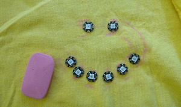
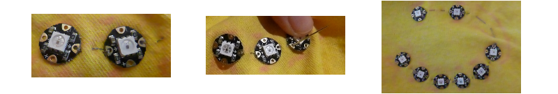

## Nähe deine Schaltung

+ Sammel alle deine NeoPixel und etwas Kreide oder einen Bleistift. Lege ein T-Shirt (oder ein Stück Stoff, auf dem du dein Projekt erstellst) auf eine ebene Fläche.

+ Ordne die Pixel in einer gewünschten Form an. Ich mache ein Smiley-Gesicht! Einige andere Ideen sind:
  + Eine gerade Linie
  + Ein Herz (acht NeoPixel sind dafür perfekt)
  + Vorstehende "Knöpfe" auf der Vorderseite des T-Shirts
  + Ein zufälliges Muster

+ Entscheide ungefähr, wo du die Flora haben möchtest, und wähle ein NeoPixel aus, mit dem es verbunden werden soll: Dies ist das erste, dass du annähst. Der Rest wird einzeln in einer Kette miteinander verbunden.

+ Ermittel die Reihenfolge, in der du die NeoPixel nähst: Du solltest in der Lage sein, einen kontinuierlichen Pfad vom ersten bis zum letzten mit deinem Finger so zu verfolgen, dass es sich nicht überkreuzt \ (dies würde Probleme mit einem Kurzschluss verursachen!\).

+ Zeichne mit Bleistift oder Kreide entlang dieses Pfades und markiere die Stelle, an der sich jedes NeoPixel befindet.

### Los geht's mit dem Nähen!

+ Wenn du alles markiert hast, lege alle Teile beiseite und nimm eine Nadel und einen leitfähigen Faden. Etwa 20 cm sollten zunächst ausreichen, wenn deine Pixel ziemlich nahe beieinander liegen. Wenn du einen Stickrahmen hast, kann die Verwendung das Nähen erheblich erleichtern.

Du wirst die **Daten** -Linie als Erstes nähen. Dies ist der Faden, der die Anweisungen (deinen Code!) übermittelt, welcher den NeoPixeln mitteilt, was zu tun ist, zum Beispiel wann sie aufleuchten sollen.

+ Nimm dein erstes NeoPixel und setze es ein. Die kleinen Pfeile zeigen darauf, wo sich das Nächste befinden wird. Befestige es am Stoff, indem du es mit dem Pfeil, der von der LED in der Mitte **weg** zeigt, durch das Loch nähst. Dieses Loch ist der ** Ausgangspin**.

--- collapse ---
---
title: Löcher oder Pins?
---

Auf Platinen, wie Adafruit Flora, Arduino oder Raspberry Pi, werden die kleinen Metallteile, mit denen du sie am Stromkreis anschließt, als ** Pins** bezeichnet.

Im Falle von **tragbarer** Elektronik, sind die Pins jedoch nicht wie Pins geformt: sie haben eine Lochform, so dass du sie mit leitenden Fäden verbinden kannst. Dies bedeutet, dass in tragbaren Projekten die Wörter "Pin" und "Loch" dasselbe bedeuten können.

--- /collapse ---

+ Stelle sicher, dass eine sichere Verbindung besteht, indem du zwei oder drei Stiche fest durch das Loch nähst.

+ Nähe einen Laufstich an die Stelle, an der sich das nächste NeoPixel befindet.

+ Nimm dann das nächste Pixel und platziere es auf seine Stelle, wobei die Pfeile weg vom ersten und hin zum nächsten Punkt zeigen. Befestige es, indem du das **Eingangs-** Loch durchnähst \(Denke daran, dies ist das Loch, in das der Pfeil **in Richtung** der LED in der Mitte zeigt\).

+ Sichere den Faden mit ein paar Stichen auf der Rückseite des Stoffes und schneide den Reste kurz ab.

--- collapse ---
---
title: Schütze die Enden
---

Es ist eine gute Idee, die Enden des Fadens nach dem Schneiden mit klarem Nagellack zu beschichten, um ein Ausfransen vorzubeugen und zu verhindern, dass umherirrende Fäden einen Kurzschluss verursachen.

--- /collapse ---

+ Verwende ein ** neues Stück des leitfähigen Fadens**, schließe es vom **Ausgangs- ** Loch des zweiten NeoPixels zum ** Eingangs-** Loch des dritten Pixels an. Fahre auf diese Weise fort, bis alle NeoPixel entlang ihrer **Daten-** Löcher mit jeweils einem separatem Stück Faden zwischen jeden Paar verkettet sind. Die Kette endet mit dem letzten NeoPixel: Setze nichts an das **Ausgangs-** Loch.

Als nächstes verbinde alle ** negativen** Löcher in der Kette und dann alle ** positiven**.

+ Benutze ein langes Stück des leitfähigen Fadens, ungefähr 50–100 cm lang, nähe ein paar enge Stiche durch die ** - ** Löcher jedes Pixels, beginnend mit dem ersten und endend mit dem letzten, und nähe einen laufenden Stich zwischen den NeoPixeln.

**Hinweis**: Stelle sicher, dass der Faden keinen der anderen Fäden in der **Daten** -Linie berührt oder kreuzt!

+ Verbinde mit einem weiteren langen Stück des leitenden Fadens alle **+** Löcher der NeoPixel auf die gleiche Weise, wie du gerade die **-** Löcher verbunden hast.

+ Lege zum Schluss das Flora-Board auf das T-Shirt (Stelle sicher, dass es **nicht in der Steckdose eingesteckt** ist! \).

+ Verwende drei **separate** Stücke des leitfähigen Fadens, verbinde den **\#6** Pin der Platine mit dem **Eingangs-** Loch des ersten NeoPixels, den **GND**Pin der Platine mit dem **-** Loch des ersten NeoPixels und den ** VBATT ** Pin der Platine mit dem **+** Loch des ersten NeoPixel, nähe einen Laufstich entlang des Stoffes. Stelle sicher, dass sich keiner der Fäden berührt.

+ Wenn du möchtest, kannst du einige der nicht verwendeten Pins von der Flora mit einigen einfachen Fäden an das T-Shirt nähen, um es sicherer an Ort und Stelle zu halten.

+ Jetzt, der Moment der Wahrheit: Stecke deine Flora in die Steckdose.

Du solltest alle deine Pixel aufleuchten sehen!

--- collapse ---
---
title: Etwas stimmt nicht
---

Wenn einige deiner NeoPixel nicht aufgeleuchtet sind, gerate nicht in Panik. Einige Ursachen könnten sein:

+ Ein Kurzschluss: Berühren sich einige Fäden? Befindet sich etwas Metallisches auf dem Stoff oder berührt es die Schaltung? Ist der Stoff nass?

+ Lose Verbindungen: Die Stiche in jedem Loch sollten für eine sichere Verbindung gut und fest sein.

+ Richtiger Code hochgeladen: Hat dein Code die richtige Anzahl von NeoPixeln definiert? Wurde er fehlerfrei kompiliert und hochgeladen?

--- /collapse --- 
