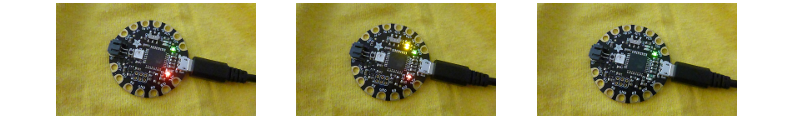

## Lights, Action!

Before you start, it is a good idea to test each of your NeoPixels. 

+ Open the Arduino IDE. Make sure the correct device is selected in the **Tools** menu. I'm using the Flora so it's **Adafruit Flora**.

+ Go to the **File** menu, select **Examples**, then find **Adafruit NeoPixel** \(it may be at the very bottom!\) and choose **strandtest**.

+ A code file opens. A code file is called a **sketch** in the Arduino IDE. Find this line of code near the top:

```
  Adafruit_NeoPixel strip = Adafruit_NeoPixel(60, PIN, NEO_GRB + NEO_KHZ800);
```

+ Change the first number to `1`. The line should look like this now:

  ```
    Adafruit_NeoPixel strip = Adafruit_NeoPixel(1, PIN, NEO_GRB + NEO_KHZ800);
  ```

+ Click **File** &gt; **Save As...**. Type in a name for your sketch and click **Save**.

+ At the top of your **sketch**, click on the tick icon to **Verify** the code. At the bottom of the window you should see the words "Done Compiling" which means the code **compiled** successfully \(if not, you will see errors printed here. To fix these you will need to do some debugging and change your code!\). 


+ Ready to upload! Plug in your Flora. Press the **reset** button on the Flora and then _straight away_, while the red light is pulsing, click on the arrow icon next to the tick to **Upload** the code onto the board. You should see the red light flashing, followed by two orange lights on the board. When it's finished, you should see the words "Done uploading." at the bottom of your sketch.  
   


--- collapse ---
---
title: Problems uploading
---

At first it can be a bit tricky to get the upload to work. Make sure the correct board is selected and that you have a working USB cable that's plugged in properly on both ends. After that, it's all about timing! You'll get the hang of it.

--- /collapse ---

+ Unplug the Flora from your computer \(the power switch on a Flora can be used to turn off the power when using a battery pack, however it does not work when plugged into a computer via USB\).

**It's important to always unplug or switch off the board before connecting or disconnecting other components so that you don't damage them!**

+ Attach three crocodile clips to the **GND**, **\#6** and **VBATT** pins.  
   


+ Take a NeoPixel and connect the **GND** wire to its **-** pin. Connect the **\#6** to the **data in** pin: this is the pin with an arrow pointing **in towards** towards the LED in the centre. Finally connect the **VBATT** to the **+** pin. 


+ Ready? Plug in the Flora once more and watch your LED start to light up and flash a multicoloured sequence!

+ Test each of your NeoPixels one by one, by connecting them up to the Flora as you've just done. Remember to **unplug the Flora** before connecting or disconnecting any wires!

+ Once you're done testing the NeoPixels, change the code again to the total number of pixels you'll be using. Mine is eight:

```
  Adafruit_NeoPixel strip = Adafruit_NeoPixel(8, PIN, NEO_GRB + NEO_KHZ800);
```

+ Click **Verify** and then **upload** the new code onto the Flora. Next you're going to make your NeoPixel circuit!


