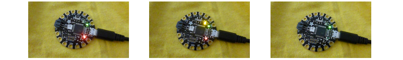

## Prueba tus LED

Antes de comenzar, es una buena idea probar cada uno de tus NeoPixels.

+ Abre el IDE de Arduino. Asegúrate de seleccionar el dispositivo correcto en el menú **Tools**. Estoy usando el Flora, así que para mí es **Adafruit Flora**.

+ Ve al menú **File** y selecciona **Examples**, luego busca **Adafruit NeoPixel** \(iPuede estar en la última parte!\) y elige **strandtest**.

Se abrirá un archivo de código. Un archivo de código se llama **sketch** en el IDE de Arduino.

+ Encuentra esta línea de código cerca de la parte superior:

```
  Adafruit_NeoPixel strip = Adafruit_NeoPixel(60, PIN, NEO_GRB + NEO_KHZ800);
```

+ Cambia el primer número a `1`. La línea debería verse así ahora:

  ```
    Adafruit_NeoPixel strip = Adafruit_NeoPixel(1, PIN, NEO_GRB + NEO_KHZ800);
  ```

+ Haz click en **File** y luego en **Save As...**. Escribe un nombre para tu sketch y haz click en **Save**.

+ En la parte superior de tu sketch haz click en el ícono de la palomita (la marca de verificación) para **verificar** el código. En la parte inferior de la ventana deberías ver las palabras "Done Compiling" (compilación finalizada), las cuales significan que el código **se compiló** con éxito \(si no, se mostrarán errores. Para solucionar esto, ¡necesitarás hacer un poco de depuración y cambiar tu código!\).


¡Listo para cargar!

+ Conecta tu Flora. Presiona el botón **reset** en el Flora y luego **straight away**, mientras las luz roja está parpadeando, haz click en la flecha junto a la marca de verificación para **upload** (cargar) el código en el tablero.

+ Debería ver la luz roja parpadeando, seguida de dos luces naranjas en el tablero. Cuando termine, deberías ver las palabras "Done uploading" (carga terminada). en la parte inferior de tu sketch.



--- collapse ---
---
title: Problemas con la carga
---

Al principio puede ser un poco complicado lograr que la carga funcione. Asegúrate de seleccionar el tablero correcto y de que tener un cable USB que funcione y que esté enchufado correctamente en ambos extremos. Después de eso, ¡todo es cuestión de tiempo! Te acostumbrarás.

--- /collapse ---

+ Desconecta el Flora de tu computadora \(puedes usar el interruptor de encendido de un Flora para apagarlo cuando uses una batería, pero no funciona cuando el tablero está conectado a una computadora a través de USB\).

**¡Es importante desconectar o apagar siempre el tablero antes de conectar o desconectar otros componentes para no dañarlos!**

+ Adjunta tres pinzas cocodrilo a los pines **GND**, **\#6** y **VBATT** del tablero.


+ Toma un NeoPixel y conecta el cable **GND** al pin negativo (**-**) del tablero. Conecta el pin **\#6** del tablero al pin **data in**: este es el pin con una flecha apuntando **in towards** hacia el centro del LED. Finalmente, conecta el **VBATT** del tablero a el pin positivo (**+**).


+ Listo? ¡Conecta el Flora una vez más y observa cómo tu LED se enciende y parpadea con una secuencia multicolor!

+ Prueba cada uno de sus otros NeoPixels uno por uno conectándolos al Flora como acabas de hacer con el primero. ¡Recuerda **desenchufar el Flora** antes de conectar o desconectar algún cable!

+ Una vez que termines de probar los NeoPixels, cambia el código nuevamente al número total de NeoPixels que vas a usar. Yo voy a usar 8:

```
  Adafruit_NeoPixel strip = Adafruit_NeoPixel(8, PIN, NEO_GRB + NEO_KHZ800);
```

+ Haga clic en **Verify** y luego en **upload** para cargar el nuevo código en el Flora. A continuación, ¡Crearás tu circuito NeoPixel!
