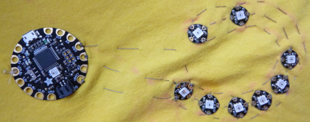

## Cose tu circuito

+ Junta todos tus NeoPixels y unas cuantas tizas o un lápiz. Coloca una camiseta \(o cualquier pedazo de tela que estes usando para este proyecto\) sobre una superficie plana.

+ Organiza los píxeles dándole la forma que desees. ¡Yo voy a hacer una carita feliz! Algunas otras ideas son:
  + Una línea recta
  + Un corazón (ocho NeoPixels son perfectos para esto)
  + Algo parecido a "botones" en la parte delantera de la camiseta
  + Un patrón aleatorio

+ Decide más o menos dónde planeas poner el Flora y elige un NeoPixel con el que conectarlo: este será el primero que coserás. El resto se conectará entre sí uno a uno en una cadena.

+ Decide el orden en el que coserás los NeoPixels: deberías poder trazar un camino continuo desde el primero hasta el último con tu dedo, de tal manera que este camino no se cruce sobre sí mismo \(¡esto podría causar un corto circuito!\).

+ Dibuja este camino con tu lápiz o tiza, marcando el lugar donde iría cada NeoPixel.

### ¡Empecemos a coser!

+ Una vez que tengas todo el camino marcado, pon aparte todas las piezas y agarra una aguja y un poco de hilo conductor. Para empezar, unos 20 cm de hilo deberían ser suficientes si los píxeles están más o menos juntos. Si tienes un bastidor de bordado, usarlo puede facilitarte mucho la costura.

Primero coserás la línea **data**. Este es el hilo que lleva las instrucciones (¡tu código!) que le dicen a los NeoPixels qué hacer, como cuándo encenderse.

+ Toma tu primer NeoPixel y colócalo en su lugar, con las pequeñas flechas apuntando hacia donde colocarás el siguiente. Sujétalo a la tela cosiendo a través del agujero con la flecha que apunta **hacia afuera** del LED en el centro. Este agujero es el **pin de salida**.

--- collapse ---
---
title: ¿Son los pines agujeros o alfileres?
---

En tableros como Adafruit Flora, Arduino o Raspberry Pi, los pequeños pedazos de metal que usas para conectarlos a tu circuito eléctrico se llaman **pines**.

En el caso de la electrónica **portátil**, los pines no tienen forma de alfileres: tienen forma de agujero, por lo que puedes conectarlos con hilo conductor. Esto significa que en los proyectos portátiles, las palabras para pin: 'alfiler' y 'agujero' pueden significar lo mismo.

--- /collapse ---

+ Asegúrate de hacer una conexión segura cosiendo dos o tres puntadas firmemente a través del agujero.

+ Cose una puntada continua en el lugar donde irá el próximo NeoPixel.

+ Luego, toma el siguiente píxel y colócalo en su lugar, con las flechas apuntando en dirección opuesta al primero y hacia el que sigue. Fíjalo cosiendo a través del agujero (o pin) de **entrada** \(recuerda que este es el agujero con la flecha apuntando **hacia el** LED en el centro\).

+ Asegura el hilo con algunas puntadas en la parte posterior de la tela y corta lo que sobra.

--- collapse ---
---
title: Protegiendo los extremos
---

Es una buena idea cubrir los extremos del hilo con esmalte de uñas transparente luego de cortarlo, para evitar que se deshilache y evitar que fibras del hilo sueltas provoquen un cortocircuito.

--- /collapse ---

+ Con un **nuevo pedazo de hilo conductor**, conecta el agujero de **salida** del segundo NeoPixel al agujero de **entrada** del tercer píxel. Continúa de esta manera hasta que todos tus NeoPixels estén encadenados a lo largo de sus agujeros de **datos**, con un pedazo de hilo adicional entre cada par. La cadena termina con el último NeoPixel: no conectes nada a su agujero de **salida**.

A continuación, conectarás todos los agujeros **negativos** en la cadena, y luego todos los **positivos**.

+ Usando un pedazo largo de hilo conductor, aproximadamente unos 50-100cm, cose algunas puntadas ajustadas a través de los agujeros negativos (**-**) de cada píxel, comenzando con el primero y terminando con el último, y cosiendo una puntada continua entre NeoPixels.

**Nota**: ¡Asegúrate de que el hilo no toque ni cruce ninguno de los hilos en la línea **datos**!

+ Con una pieza más larga de hilo conductor, conecta todos los agujeros positivos (**+**) de los NeoPixels de la misma manera que acabas de conectar los agujeros negativos (**-**).

+ Por último, coloca el tablero de Flora en la camiseta \(¡asegúrate de que **no esté enchufado**!\).

+ Usando tres pedazos **separados** de hilo conductor, conecta el agujero **#6** al agujero de **entrada** del primer NeoPixel, el agujero **GND** del tablero al agujero negativo (**-**) del primer NeoPixel, y el agujero **VBATT** al agujero positivo (**+**) del primer NeoPixel, cosiendo una puntada continua a lo largo de la tela. Asegúrate de que ninguno de los hilos se toque entre sí.

+ Si lo deseas, puede coser algunos de los pines no utilizados de el Flora a la camiseta con un hilo simple para mantenerla más segura en su lugar.

+ Ahora, el momento de la verdad: conecta tu Flora.

¡Deberías ver todos tus NeoPixels encendidos!

--- collapse ---
---
title: Algo no está bien
---

Si algunos de tus NeoPixels no se encendieron, no te asustes. Algunas causas pueden ser:

+ Un cortocircuito: ¿se tocan algunos de los hilos? ¿Hay algo metálico en la tela o tocando el circuito? ¿Está mojada la tela?

+ Conexiones sueltas: las puntadas en cada agujero deben estar firmes y ajustadas para una conexión segura.

+ Se cargó el código correcto: ¿Tu código tiene el número definido de NeoPixels correcto? ¿Se compiló y cargó sin errores?

--- /collapse --- 
