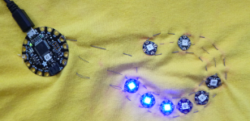

## Escribe tu propio código

+ En el IDE de Arduino, haz clic en **File** y luego en **New**. Obtendrás un **sketch** en blanco que se ve así:
```
    void setup() {
        // coloca tu código de configuración aquí, para que se ejecute una vez:

    }
    void loop() {
        //coloca tu código principal aquí, para que se ejecute repetidamente:

    }
```

--- collapse ---
---
title: Tomando notas en tu código
---

Cualquier línea que comience con `//` es un **comentario**. La computadora ignora los comentarios.

¡Son útiles para tomar notas para ti mismo o para otros que quieran usar tu código!

--- /collapse ---

+ Ve al menú **Sketch**, luego a **Include Library** y selecciona **Adafruit NeoPixel**. Deberías ver que este código se agrega en la parte superior de tu sketch: `#include <Adafruit_NeoPixel.h>`.

+ Haz clic al final de la línea y presiona la tecla <kbd>Enter</kbd> varias veces para agregar algunas líneas en blanco debajo.

+ Debajo de la nueva línea de código, escribe lo siguiente: `#define PIXELS_PIN 6`

Con este código estás configurando qué pin (recuerda que es lo mismo que un agujero aquí) de Flora usar para **datos** \(instrucciones\). Entonces, el pin que conectas a los agujeros de **datos** de los NeoPixels es el número **6**.

+ Debajo de eso, escribe `#define NUM_PIXELS 8`. Este es el número de NeoPixels que tienes. Si tuvieras un número diferente al ocho, escribe ese número en lugar de `8`.

+ Por último, debajo de eso, escribe:

``` 
    Adafruit_NeoPixel strip = Adafruit_NeoPixel(NUM_PIXELS, PIXELS_PIN, NEO_GRB + NEO_KHZ800);
```

+ Dentro de la función `setup`, agrega las siguientes dos líneas:

``` 
    void setup() {
        // coloca tu código de configuración aquí, para que se ejecute una vez:
        strip.begin();
        strip.show();
    }
```

--- collapse ---
---
title: ¿Qué es la función setup?
---

El código `void setup ()` define la función `setup`. Este es un bloque de código que se ejecuta cuando se enciende Flora.

Todo el código entre las llaves `{` y `}` está en la función y se ejecutará cuando se encienda Flora.

--- /collapse ---

+ Después de `strip.show ();`, presiona <kbd>Entrar</kbd> y escribe estas dos líneas a continuación:

``` 
    strip.setPixelColor(0, strip.Color(0, 0, 255));
    strip.show();
```

+ Haz clic en **Verify** para compilar tu código y comprobar si hay errores. Si hay algún error, deberás corregir el código y verificarlo nuevamente. Por lo general, los mensajes de error te indican qué línea de código necesita corregirse. ¡Comprueba que lo hayas escrito exactamente como se te mostró!

+ ¡Conectemos Flora y ejecutemos tu código! Presiona el botón **reset** en Flora y luego el botón **Upload**. Cuando lo hiciste, ¿qué pasa?

Deberías ver el primer NeoPixel encenderse en azul.

+ ¡Hagamos otro! **Por encima** del segundo `strip.show ();`, escribe dos líneas más:

```
    strip.setPixelColor(1, strip.Color(0, 0, 255));
    strip.setPixelColor(2, strip.Color(0, 0, 255));
```

La función `setup` debería verse así ahora:

``` 
    void setup() {
        // coloca tu código de configuración aquí, para que se ejecute una vez:
        strip.begin();
        strip.show();
        strip.setPixelColor(0, strip.Color(0, 0, 255));
        strip.setPixelColor(1, strip.Color(0, 0, 255));
        strip.setPixelColor(2, strip.Color(0, 0, 255));
        strip.show();
    }
```

¿Puedes descubrir qué está haciendo parte de este código?

+ Verifica y carga tu código una vez más. Esta vez deberías ver que los primeros tres NeoPixels se encenderse en azul.

+ ¡Ve si puedes agregar más líneas de código para que el resto de los píxeles se enciendan también!




