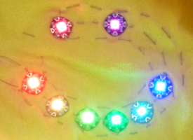

## Introduction

Ces cartes Sushi te montreront comment utiliser des LED portables et programmables et comment les contrôler avec du code.

**ATTENTION** : ce projet implique des lumières clignotantes brillantes ! Il peut ne pas convenir si des personnes souffrant d'épilepsie sont présentes.

### Ce que tu feras

Dans ce projet, tu vas coudre des lumières LED sur un t-shirt et écrire du code pour les faire clignoter et changer de couleur !



--- collapse ---
---
title: Ce que tu vas apprendre
---

+ Tester les NeoPixels
+ Assemblage d'un circuit NeoPixel avec flux positif, négatif et de données
+ Le déroulement d'un programme Flora (fonctions setup et loop)
+ Activer et désactiver des NeoPixels
+ Adresser des NeoPixels individuels
+ Mélanger de couleurs RVB
+ Fonctions et paramètres
+ Utilisation des boucles for
+ Explorer des exemples plus avancés

--- /collapse ---

--- collapse ---
---
title: Ce que tu auras besoin
---

### Matériel informatique

+ Adafruit Flora ou Gemma
+ Un câble USB
+ Environ huit NeoPixels
+ Fil conducteur
+ Trois paires de pinces crocodiles \ (tu peux également utiliser des morceaux de fil conducteur à la place, mais les pinces crocodiles peuvent être plus faciles pour tester \)
+ En option : une batterie, qui te permettra de porter ton projet fini sans qu'il soit attaché à un ordinateur !

Les LED seront contrôlées par l'Adafruit Flora. Tu peux également utiliser un Adafruit Gemma, LilyPad Arduino ou LilyPad Arduino USB ; si te le fais, de petits changements de code seront nécessaires, tels que le numéro de la broche de sortie et la configuration de la carte dans Arduino IDE.

Remarque : le Gemma ne fonctionne pas avec le système d'exploitation Linux. Il ne fonctionnera pas non plus avec un port USB 3.0, tu dois donc disposer d'un port ou d'un hub USB 2.0 pour connecter la Gemma à l'ordinateur.

### Logiciel

+ Arduino IDE

### Installation et configuration de Arduino IDE

+ Télécharge Arduino IDE à partir de [dojo.soy/wear2-arduino-ide](http://dojo.soy/wear2-arduino-ide){:target="_ blank"} et installe-le.

+ Une fois installée, ouvre l'application. Il y a quelques éléments supplémentaires nécessaires pour que cela fonctionne pour ce projet.

+ Ouvre **Préférences** à partir du menu d'**Arduino**. Dans la zone **URL de gestionnaire de cartes supplémentaires**, colle ce qui suit et clique sur OK.

```
    https://adafruit.github.io/arduino-board-index/package_adafruit_index.json
```

+ Dans le menu **Outils**, va dans **Type de carte** et sélectionne **Gestionnaire de carte**. Choisis **Contribué** dans le menu déroulant. Installe **Adafruit AVR Boards by Adafruit**. Ensuite, clique sur **Fermer**.

+ Quitte et redémarre Arduino IDE. Va à nouveau au menu **Type de carte** et tu devrais voir **Adafruit Flora**, **Adafruit Gemma**, **LilyPad Arduino**et **LilyPad Arduino USB** répertoriés. Sélectionne la carte que tu utiliseras.

+ Dans le menu **Croquis** , va à **Inclure une bibliothèque** et sélectionne **Gérer les bibliothèques**. Tape `neopixel` dans la barre de recherche. Installe **Adafruit NeoPixel by Adafruit**. Clique ensuite sur **Fermer**.

### Matériels additionnels

+ Une aiguille à broder et des ciseaux
+ Un t-shirt
+ Vernis à ongles transparent
+ En option : un cercle de broderie (recommandé pour faciliter la couture de ton circuit)

--- /collapse ---
