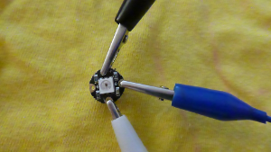

## Tester tes LED

Avant de commencer, c'est une bonne idée de tester chacun de tes NeoPixels.

+ Ouvre Arduino IDE. Assure-toi que le bon périphérique est sélectionné dans le menu **Outils**. J'utilise le Flora, donc pour moi c'est **Adafruit Flora**.

+ Va dans le menu **Fichier** , sélectionne **Exemples**, puis trouve **Adafruit NeoPixel** \(il se peut qu'il soit tout en bas !\) Et choisis **strandtest**.

Un fichier de code s'ouvre. Un fichier de code est appelé un **croquis** dans Arduino IDE.

+ Trouve cette ligne de code vers le haut :

```
  Adafruit_NeoPixel strip = Adafruit_NeoPixel(60, PIN, NEO_GRB + NEO_KHZ800);
```

+ Remplace le premier nombre par `1`. La ligne devrait ressembler à ceci maintenant :

  ```
    Adafruit_NeoPixel strip = Adafruit_NeoPixel(1, PIN, NEO_GRB + NEO_KHZ800);
  ```

+ Clique sur **Fichier** puis sur **Enregistrer sous ...**. Tape un nom pour ton croquis et clique sur **Enregistrer**.

+ En haut de ton croquis, clique sur l'icône de coche (la coche) pour **vérifier** le code. Au bas de la fenêtre, tu devrais voir les mots « Compilation terminée », ce qui signifie que le code est **compilé** avec succès \(sinon, tu verras des erreurs affichées ici. Pour résoudre ces problèmes, tu devras effectuer un débogage et modifier ton code !\).


Prêt à télécharger !

+ Branche ton Flora. Appuie sur le bouton **reset** sur le Flora, puis sur **tout de suite**, pendant que la lumière rouge clignote, clique sur l'icône en forme de flèche à côté de la coche / coche pour **télécharger** le code sur la carte.

+ Tu devrais voir le voyant rouge clignoter, suivi de deux voyants orange sur la carte. Une fois l'opération terminée, tu devrais voir les mots « Téléchargement terminé ». en bas de ton croquis.


--- collapse ---
---
title: Problèmes de téléchargement
---

Au début, il peut être un peu difficile de faire fonctionner le téléchargement. Assure-toi que la bonne carte est sélectionnée et que tu disposes d'un câble USB en état de marche correctement branché aux deux extrémités. Après cela, tout est question de timing ! Tu comprendras.

--- /collapse ---

+ Débranche le Flora de ton ordinateur \(tu peux utiliser l'interrupteur d'alimentation d'un Flora pour l'éteindre lorsque tu utilises une batterie, mais cela ne fonctionne pas lorsque la carte est branchée sur un ordinateur via USB\).

**Il est important de toujours débrancher ou éteindre la carte avant de connecter ou de déconnecter d'autres composants afin de ne pas les endommager !**

+ Fixe trois pinces crocodiles aux broches **GND**, **\#6** et **VBATT** de la carte.


+ Prends un NeoPixel et connecte le fil **GND** de la carte à sa broche **-**. Connecte la broche **\#6** de la carte à la broche **data in** : c'est la broche avec une flèche pointant **vers** la LED au centre. Enfin, connecte le **VBATT** de la carte à la broche **+**.



+ Prêt ? Rebranche le Flora et regarde ta LED commencer à s'allumer et à exécuter une séquence multicolore !

+ Teste chacun de tes autres NeoPixels un par un en les connectant au Flora comme tu viens de le faire avec ton premier. Rappelle-toi de **débrancher le Flora** avant de brancher ou de débrancher les fils !

+ Une fois que tu as terminé de tester les NeoPixels, modifie à nouveau le code au nombre total de NeoPixels que tu utiliseras. Le mien est huit :

```
  Adafruit_NeoPixel strip = Adafruit_NeoPixel(8, PIN, NEO_GRB + NEO_KHZ800);
```

+ Clique sur **Vérifier**, puis sur **télécharger** le nouveau code sur le Flora. Ensuite, tu vas créer ton circuit NeoPixel !
