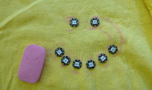

## Coudre ton circuit

+ Rassemble tous tes NeoPixels et de la craie ou un crayon. Pose un t-shirt \(ou tout autre morceau de tissu sur lequel tu crées ton projet\) sur une surface plane.

+ Dispose les pixels dans une forme que tu aimes. Je vais faire un visage souriant ! Quelques autres idées :
  + Une ligne droite
  + Un cœur (huit NeoPixels sont parfaits pour cela)
  + Faire semblant d'avoir des « boutons » sur le devant du t-shirt
  + Un motif aléatoire

+ Décide à peu près où tu prévois d'avoir le Flora, et choisis un NeoPixel auquel il sera connecté : ce sera le premier que tu couds. Le reste sera connecté les uns aux autres dans une chaîne.

+ Détermine l'ordre dans lequel tu vas coudre les NeoPixels : tu devrais pouvoir tracer un chemin continu du premier au dernier avec ton doigt de manière à ce qu'il ne se croise pas \(cela poserait des problèmes avec un court circuit !\).

+ Dessine environ ce chemin avec le crayon ou la craie, en marquant l'endroit où se trouve chaque NeoPixel.

### Commençons à coudre !

+ Une fois que tu as tout marqué, mets de côté toutes les pièces et prends une aiguille et du fil conducteur. Environ 20 cm devraient suffire pour commencer si tes pixels sont assez rapprochés. Si tu as un cercle à broder, son utilisation peut rendre la couture beaucoup plus facile.

Tu couds d'abord la ligne **data**. C'est le fil qui contient les instructions (ton code !) Indiquant aux NeoPixels quoi faire, comme quand s'allumer.

+ Prends ton premier NeoPixel et mets-le en place, avec les petites flèches pointant vers l'endroit où sera le prochain. Fixe-le au tissu en cousant à travers le trou avec la flèche qui pointe **à l'opposé** de la LED au centre. Ce trou est la **broche output**.

--- collapse ---
---
title: Trous ou broches ?
---

Sur des cartes comme Adafruit Flora, Arduino ou Raspberry Pi, les petits morceaux de métal que tu utilises pour les connecter à ton circuit électrique sont appelés **broches**.

Dans le cas d'objets **portables**, les broches ne sont pas comme des broches : ils ont une forme de trou, de sorte que tu peux les connecter avec un fil conducteur. Cela signifie que dans les projets de dispositifs portables, les mots « broche » et « trou » peuvent signifier la même chose.

--- /collapse ---

+ Assure-toi d'établir une connexion sécurisée en cousant deux ou trois points étroitement à travers le trou.

+ Couds un point coulé à l'endroit où ira le prochain NeoPixel.

+ Prends ensuite le pixel suivant et place-le sur son emplacement, les flèches pointant vers l'extérieur du premier et vers l'emplacement suivant. Fixe-le en le cousant à travers le trou **input** \(rappelle-toi, c'est le trou avec la flèche pointant **vers** la LED au centre\).

+ Fixe le fil avec quelques points de couture à l'arrière du tissu et coupe court ce qui reste.

--- collapse ---
---
title: Protéger les extrémités
---

C'est une bonne idée de recouvrir les extrémités du fil de vernis à ongles transparent après la coupe, pour éviter l'effilochage et éviter que les fils parasites ne provoquent un court-circuit.

--- /collapse ---

+ À l'aide d'un **nouveau morceau de fil conducteur**, connecte le trou **output** du deuxième NeoPixel au trou **input** du troisième pixel. Continue de cette manière jusqu'à ce que tous les NeoPixels soient enchaînés le long de leurs trous **data** , avec un morceau de fil séparé entre chaque paire. La chaîne se termine par le dernier NeoPixel : tu ne fixes rien à son trou **output**.

Ensuite, tu connecteras tous les trous **négatifs** de la chaîne, puis tous les trous **positifs**.

+ À l'aide d'un long morceau de fil conducteur, d'environ 50 à 100 cm, couds quelques points serrés à travers le trou **-** de chaque pixel, en commençant par le premier et en terminant par le dernier, puis en cousant un point coulé entre les NeoPixels.

**Remarque** : assure-toi que le fil ne touche ni ne croise aucun des fils de la ligne **data** !

+ Avec une pièce plus longue de fil conducteur, connecter tous les trous **+** des NeoPixels de la même manière que tu viens de connecter les trous **-**.

+ Enfin, place la carte Flora sur le t-shirt \(assure-toi qu'elle est **débranchée** !\).

+ En utilisant trois morceaux **séparés** de fil conducteur, connecte le trou **\#6** de la carte au trou **input** du premier NeoPixel, le trou **GND** de la carte au trou **-** du premier NeoPixel, et les trous **VBATT** de la carte dans le trou **+** du premier NeoPixel, en cousant un point coulé le long du tissu. Assure-toi qu'aucun des fils ne se touche.

+ Si tu le souhaites, tu peux coudre certaines des broches inutilisées du Flora au t-shirt avec du fil uni pour le maintenir plus solidement en place.

+ Maintenant, le moment de vérité : branche ton Flora.

Tu devrais voir tous tes NeoPixels s'allumer !

--- collapse ---
---
title: Quelque chose ne va pas
---

Si certains de tes NeoPixels ne s'allument pas, ne panique pas. Cela pourrait être dû :

+ Un court-circuit : l'un des fils se touche-t-il ? Y a-t-il quelque chose de métallique sur le tissu ou en contact avec le circuit ? Le tissu est-il mouillé ?

+ Connexions desserrées : les points de chaque trou doivent être correctement serrés pour assurer une connexion sûre.

+ Code correct téléchargé : ton code a-t-il défini le bon nombre de NeoPixels ? A-t-il compilé et téléchargé sans erreurs ?

--- /collapse --- 
