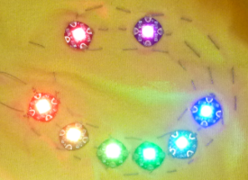

## परिचय

ये सुशी कार्ड आपको दिखाएंगे कि पहनने योग्य, प्रोग्राम योग्य LED का उपयोग कैसे करें और कोड के साथ उन्हें कैसे नियंत्रित करें।

**चेतावनी**: इस परियोजना में चमकती रोशनी शामिल है! It may not be suitable if there are people who have epilepsy present.

### आप क्या बनाएँगे

इस परियोजना में, आप LED रोशनी को एक टी-शर्ट में सीवे करेंगे और उन्हें फ्लैश और रंग बदलने के लिए Code लिखेंगे!



--- collapse ---
---
title: आप क्या सीखेंगे
---

+ NeoPixels का परीक्षण
+ सकारात्मक (positive), नकारात्मक (negative) और डेटा प्रवाह (data flow) के साथ एक NeoPixel सर्किट की सिलाई
+ फ्लोरा प्रोग्राम का प्रवाह (सेटअप और लूप फ़ंक्शन)
+ NeoPixels चालू और बंद करना
+ व्यक्तिगत NeoPixels को संबोधित करना
+ RGB रंग मिश्रण
+ फूकंशन्स और पैरामीटर्स
+ लूप्स के लिए उपयोग करना
+ अधिक उन्नत उदाहरण तलाशना

--- /collapse ---

--- collapse ---
---
title: आपको किन चीजों की आवश्यकता होगी
---

### हार्डवेयर

+ Adafruit Flora या Gemma
+ एक USB केबल
+ लगभग 8 NeoPixels
+ प्रवाहकीय धागा
+ मगरमच्छ क्लिप के तीन चिमटा (आप इसके बजाय प्रवाहकीय धागे के टुकड़ों का भी उपयोग कर सकते हैं, लेकिन मगरमच्छ क्लिप के साथ परीक्षण करना आसान हो सकता है)
+ वैकल्पिक: एक बैटरी पैक, जो आपको कंप्यूटर के साथ संलग्न किए बिना अपनी तैयार परियोजना को पहनने की अनुमति देगा!

LED को Adafruit Flora द्वारा नियंत्रित किया जाएगा। आप एक Adafruit Gemma, LilyPad Arduino या LilyPad Arduino USB का भी उपयोग कर सकते हैं; यदि आप करते हैं, तो कुछ छोटे कोड परिवर्तनों की आवश्यकता होगी, जैसे आउटपुट पिन की संख्या और Arduino IDE में बोर्ड सेटअप।

ध्यान देना: Gemma Linux ऑपरेटिंग सिस्टम (Os) के साथ काम नहीं करता है। यह USB 3.0 पोर्ट के साथ भी काम नहीं करेगा, इसलिए कंप्यूटर से Gemma को जोड़ने के लिए आपके पास USB 2.0 पोर्ट या हब होना चाहिए।

### सॉफ्टवेयर

+ Arduino IDE

### शीर्षक: Arduino IDE को स्थापित करना और स्थापित करना

+ Arduino को डाउनलोड करें [dojo.soy/wear2-arduino-ide](http://dojo.soy/wear2-arduino-ide){:target="_blank"} और स्थापित करें

+ इंस्टॉल हो जाने के बाद, आवेदन खोलें। इस परियोजना के लिए इसे बनाने के लिए कुछ अतिरिक्त चीजों की आवश्यकता है।

+ **Preferences** खोलें **Arduino** मेन्यू से I **Additional Board Manager URLs** के बॉक्स में, निम्नलिखित पेस्ट करें और OK पर क्लिक करें।

```
    https://adafruit.github.io/arduino-board-index/package_adafruit_index.json
```

+ **Tools** मेन्यू में, **Boards** पर जाएं और **Boards Manager... ** चुनें । **Contributed** ड्रॉप-डाउन मेनू से चुनें । स्थापित करें **Adafruit AVR Boards by Adafruit** फिर, **Close** पर क्लिक करें ।

+ Arduino IDE को छोड़ें और पुनः आरंभ करें। **Boards** मेन्यू पर जाएं फिर से और आपको **Adafruit Flora** **Adafruit Gemma **, **LilyPad Arduino**, और **LilyPad Arduino USB** सूचीबद्ध दिखना चाहिए। उस बोर्ड को चुनना जिसका आप उपयोग कर रहे हैं।

+ **Sketch** मेन्यू में, **Include Library** पर जाएं </strong>और **Manage Libraries...</0> को चुनें। टाइप करें ` neopixel ` खोज बॉक्स में। स्थापित करें **Adafruit Avr Boards by Adafruit** फिर, **Close** पर क्लिक करें ।</p></li> </ul>

### अतिरिक्त सामग्री

+ एक कढ़ाई सुई और कैंची
+ एक टी शर्ट
+ साफ नेल पॉलिश
+ वैकल्पिक: एक कढ़ाई घेरा (सिलाई को आसान बनाने के लिए अनुशंसित)

--- /collapse ---
