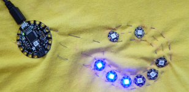

## अपना कोड (code) लिखें

+ Arduino IDE में, **File** पर क्लिक करें और फिर **New** दबाएं । आपको एक रिक्त ** स्केच** (sketch) मिलेगा जो इस तरह दिखता है:
```
    void setup() {
        // put your setup code here, to run once:

    }
    void loop() {
        // put your main code here, to run repeatedly:

    }
```

--- collapse ---
---
title: अपने कोड में नोट्स बनाना
---

कोई भी रेखा जो `//` से शुरू होती है वह एक **टिप्पणी** (comment) है । कंप्यूटर द्वारा टिप्पणियों को अनदेखा किया जाता है।

वे अपने लिए, या अपने कोड के लिए अन्य लोगों के लिए नोट्स बनाने के लिए उपयोगी हैं!

--- /collapse ---

+ **स्केच** मेन्यू, **Include Library** और **Adafruit NeoPixel** पर जाएं और चुनें। आपको अपने स्केच के शीर्ष पर इस कोड को जोड़कर देखना चाहिए: `#include<Adafruit_NeoPixel.h>` ।

+ पंक्ति के अंत में क्लिक करें और <kbd>Return</kbd> कुंजी कुछ बार दबाएं इसके नीचे कुछ खाली लाइनें जोड़ने के लिए।

+ कोड की नई लाइन के नीचे, निम्न लिखें: `#define PIXELS_PIN 6`

इस कोड से आप फ्लोरा के पिन **डेटा** के लिए कौन सा पिन (यहाँ एक छेद के रूप में याद रखें) सेट कर रहे हैं (निर्देश)। तो पिन आप **डेटा** से कनेक्ट करें NeoPixels के छेद संख्या **6** है ।

+ उसके नीचे, `#define NUM_PIXELS 8` लिखें। यह आपके पास NeoPixels की संख्या है। यदि आपके पास आठ से भिन्न संख्या है, तो उस संख्या को `8` के बजाय टाइप करें ।

+ अंत में, उसके नीचे, टाइप करें:

``` 
    Adafruit_NeoPixel strip = Adafruit_NeoPixel(NUM_PIXELS, PIXELS_PIN, NEO_GRB + NEO_KHZ800);
```

+ `setup` फ़ंक्शन के अंदर, निम्न दो लाइनें जोड़ें:

``` 
    void setup() {
        // put your setup code here, to run once:
        strip.begin();
        strip.show();
    }
```

--- collapse ---
---
title: सेटअप फ़ंक्शन क्या है?
---

कोड `void setup ()` `setup` फंक्शन को परिभाषित करता है। यह कोड का एक ब्लॉक है जो फ्लोरा चालू होने पर चलता है।

घुंघराले ब्रैकेट्स के बीच सभी कोड `{` और `}` फंक्शन में है और इसलिए जब फ्लोरा चालू होगा तब चलेगा।

--- /collapse ---

+ `strip.show();` के बाद, <kbd>Return</kbd> दबाएं और नीचे इन दो पंक्तियों को टाइप करें:

``` 
    strip.setPixelColor(0, strip.Color(0, 0, 255));
    strip.show();
```

+ **Verify** पर क्लिक करें और अपना कोड संकलित करने और गलतियाँ की जांच करने के लिए। यदि कोई गलती है, तो आपको कोड को ठीक करना होगा और इसे फिर से जांचना होगा। आमतौर पर गलतियों का संदेश आपको बताते हैं कि किस कोड को ठीक करने की आवश्यकता है। जाँचें कीजिये कि आपने उसे ठीक दिखाया है!

+ चलो फ्लोरा में प्लग करें और अपना कोड चलाएं! **reset** दबाएं फ्लोरा पर बटन और फिर **Upload** बटन दबाएं। जब यह हो जाता है, तो क्या होता है?

आपको पहला NeoPixel नीला लाइट जलते हुए दिखना चाहिए ।

+ चलो दूसरा करो! दूसरे `strip.show();` के **ऊपर**, दो लाइनें और टाइप करें:

```
    strip.setPixelColor(1, strip.Color(0, 0, 255));
    strip.setPixelColor(2, strip.Color(0, 0, 255));
```

`setup` फ़ंक्शन इस तरह दिखना चाहिए:

``` 
    void setup() {
        // put your setup code here, to run once:
        strip.begin();
        strip.show();
        strip.setPixelColor(0, strip.Color(0, 0, 255));
        strip.setPixelColor(1, strip.Color(0, 0, 255));
        strip.setPixelColor(2, strip.Color(0, 0, 255));
        strip.show();
    }
```

क्या आप यह पता लगा सकते हैं कि इस कोड में से कुछ क्या कर रहा है?

+ अपना कोड एक बार और सत्यापित (verify) करें और अपलोड (upload) करें। अब आपको इस बार पहले तीन NeoPixels नीले रंग कि जलते हुए दिखने चाहिए।

+ देखें कि क्या आप बाकी पिक्सेल को हल्का बनाने के लिए कोड की अधिक पंक्तियाँ जोड़ सकते हैं!




