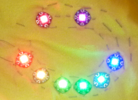

## Introduction

These Sushi Cards will show you how to use wearable, programmable LEDs and how to control them with code.

**WARNING**: this project involves bright flashing lights! It may not be suitable if there are people who have epilepsy present.

### What you will make

In this project, you will sew LED lights to a T-shirt and write code to make them flash and change colour!



--- collapse ---
---
title: What you will learn
---

+ Testing NeoPixels
+ Stitching a NeoPixel circuit with positive, negative, and data flow
+ The flow of a Flora program (setup and loop functions)
+ Turning NeoPixels on and off
+ Addressing individual NeoPixels
+ RGB colour mixing
+ Functions and parameters
+ Using for loops
+ Exploring more advanced examples

--- /collapse ---

--- collapse ---
---
title: What you will need
---

### Hardware

+ Adafruit Flora or Gemma
+ A USB cable
+ Around eight NeoPixels
+ Conductive thread
+ Three pairs of crocodile clips \(you can also use pieces of conductive thread instead, but crocodile clips may be easier to test with\)
+ Optional: a battery pack, which will allow you to wear your finished project without it being attached to a computer!

The LEDs will be controlled by the Adafruit Flora. You could also use an Adafruit Gemma, LilyPad Arduino, or LilyPad Arduino USB; if you do, some small code changes will be needed, such as the number of the output pin and the board setup in the Arduino IDE.

Note: the Gemma does not work with the Linux operating system. It also won't work with a USB 3.0 port, so you must have a USB 2.0 port or hub to connect the Gemma to the computer.

### Software

+ The Arduino IDE

### Installing and setting up the Arduino IDE

+ Download the Arduino IDE from [dojo.soy/wear2-arduino-ide](http://dojo.soy/wear2-arduino-ide){:target="_blank"} and install it.

+ Once it's installed, open the application. There a few extra things needed to make it work for this project.

+ Open the **Preferences** from the **Arduino** menu. In the **Additional Board Manager URLs** box, paste the following and click OK.

```
    https://adafruit.github.io/arduino-board-index/package_adafruit_index.json
```

+ In the **Tools** menu, go to **Boards** and select **Boards Manager...**. Choose **Contributed** from the drop-down menu. Install **Adafruit AVR Boards by Adafruit**. Then click **Close**.

+ Quit and restart the Arduino IDE. Go to the **Boards** menu again and you should see the **Adafruit Flora**, **Adafruit Gemma**, **LilyPad Arduino**, and **LilyPad Arduino USB** listed. Select the board you will be using.

+ In the **Sketch** menu, go to **Include Library** and select **Manage Libraries...**. Type `neopixel` into the search box. Install **Adafruit NeoPixel by Adafruit**. Then click **Close**.

### Additional materials

+ An embroidery needle and scissors
+ A T-shirt
+ Clear nail polish
+ Optional: an embroidery hoop (recommended to make stitching up your circuit easier)

--- /collapse ---
