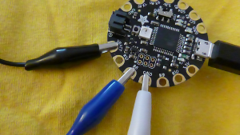

## ನಿಮ್ಮ ಎಲ್ಇಡಿಗಳನ್ನು ಪರೀಕ್ಷಿಸಿ

ನೀವು ಪ್ರಾರಂಭಿಸುವ ಮೊದಲು, ನಿಮ್ಮ ಪ್ರತಿಯೊಂದು ನಿಯೋಪಿಕ್ಸೆಲ್‌ಗಳನ್ನು ಪರೀಕ್ಷಿಸುವುದು ಒಳ್ಳೆಯದು.

+ Arduino IDE ಯನ್ನು ತೆರೆಯಿರಿ. **Tools** ಮೆನು ನಲ್ಲಿ ಸರಿಯಾದ ಸಾಧನವನ್ನು ಆಯ್ಕೆ ಮಾಡಲಾಗಿದೆ ಎಂದು ಖಚಿತಪಡಿಸಿಕೊಳ್ಳಿ. ನಾನು Flora ವನ್ನು ಬಳಸುತ್ತಿದ್ದೇನೆ, ಆದ್ದರಿಂದ ನನಗೆ ಇದು **Adafruit Flora**.

+ **File** ಮೆನು‌ಗೆ ಹೋಗಿ, **Examples** ಆರಿಸಿ, ನಂತರ **Adafruit NeoPixel** ಅನ್ನು ಹುಡುಕಿ \(ಇದು ಅತ್ಯಂತ ಕೆಳಭಾಗದಲ್ಲಿರಬಹುದು!\) ಮತ್ತು **strandtest** ಆಯ್ಕೆಮಾಡಿ.

ಒಂದು ಕೋಡ್ ಫೈಲ್ ತೆರೆಯುತ್ತದೆ. ಒಂದು ಕೋಡ್ ಫೈಲ್ ಅನ್ನು Arduino IDE ನಲ್ಲಿ ಒಂದು **ಸ್ಕೆಚ್** (sketch) ಎಂದು ಕರೆಯಲಾಗುತ್ತದೆ.

+ ಮೇಲ್ಭಾಗದ ಹತ್ತಿರ ಈ ಸಾಲಿನ ಕೋಡ್ ಅನ್ನು ಹುಡುಕಿ:

```
  Adafruit_NeoPixel strip = Adafruit_NeoPixel(60, PIN, NEO_GRB + NEO_KHZ800);
```

+ ಮೊದಲ ಸಂಖ್ಯೆಯನ್ನು `1`ಕ್ಕೆ ಬದಲಾಯಿಸಿ. ನಿಮ್ಮ ಪಠ್ಯವು ಈಗ ಈ ರೀತಿ ಕಾಣಿಸಬೇಕು:

  ```
    Adafruit_NeoPixel strip = Adafruit_NeoPixel(1, PIN, NEO_GRB + NEO_KHZ800);
  ```

+ **File** ಕ್ಲಿಕ್ ಮಾಡಿ ತದನಂತರ **Save As...**. ನಿಮ್ಮ ಸ್ಕೆಚ್‌ಗಾಗಿ ಹೆಸರನ್ನು ಟೈಪ್ ಮಾಡಿ ಮತ್ತು **Save** ಕ್ಲಿಕ್ ಮಾಡಿ.

+ ನಿಮ್ಮ ಸ್ಕೆಚ್‌ನ ಮೇಲ್ಭಾಗದಲ್ಲಿ, **verify** ಕೋಡ್ (ಚೆಕ್ ಮಾರ್ಕ್) ಐಕಾನ್ ಸೇಲೆಕ್ಟ್ ಮಾಡಿ. ವಿಂಡೋದ ಕೆಳಭಾಗದಲ್ಲಿ ನೀವು "ಸಂಕಲನ ಮುಗಿದಿದೆ" (Done Compiling) ಎಂಬ ಪದಗಳನ್ನು ನೋಡಿದರೆ, ಕೋಡ್ ಯಶಸ್ವಿಯಾಗಿ **ಕಂಪೈಲ್** ಆಗಿದೆ (compiled) ಎಂದರ್ಥ \(ಇಲ್ಲವಾದಲ್ಲಿ ನೀವು ಇಲ್ಲಿ ಮುದ್ರಿತವಾದ ತಪ್ಪುಗಳನ್ನು ನೋಡುವಿರಿ. ಇವುಗಳನ್ನು ಸರಿಪಡಿಸಲು, ನೀವು ಸ್ವಲ್ಪ ಡೀಬಗ್ (debug) ಮಾಡಿ ಕೋಡ್ ಅನ್ನು ಬದಲಾಯಿಸಬೇಕಾವುದು!\).


ಅಪ್‌ಲೋಡ್ ಮಾಡಲು ಸಿದ್ಧವಾಗಿದೆ!

+ ನಿಮ್ಮ Floraವನ್ನು ಪ್ಲಗ್ ಮಾಡಿ. Flora ಮೇಲೆ **reset** ಬಟನ್ ಒತ್ತಿರಿ; ನಂತರ **ಕೂಡಲೇ**, ಕೆಂಪು ದೀಪವು ಸ್ಪಂದಿಸುತ್ತಿರುವಾಗ, ಬೋರ್ಡ್‌ನಲ್ಲಿರುವ ಕೋಡ್ **upload** ಮಾಡಲು ಟಿಕ್ / ಚೆಕ್ ಮಾರ್ಕ್‌ನ ಪಕ್ಕದಲ್ಲಿರುವ ಬಾಣ ಐಕಾನ್ ಕ್ಲಿಕ್ ಮಾಡಿ.

+ ನೀವು ಕೆಂಪು ಬೆಳಕಿನ ಮಿನುಗುವಿಕೆಯನ್ನು ನೋಡಬೇಕು, ಅದರ ನಂತರ ಎರಡು ಕಿತ್ತಳೆ ದೀಪಗಳು ಬೋರ್ಡ್‌ನಲ್ಲಿರುತ್ತವೆ. ಅದು ಮುಗಿದ ನಂತರ, ನಿಮ್ಮ ಸ್ಕೆಚ್‌ನ ಕೆಳಭಾಗದಲ್ಲಿ"ಅಪ್‌ಲೋಡ್ ಮುಗಿದಿದೆ" ("Done uploading.") ಎಂಬ ಪದಗಳನ್ನು ನೀವು ನೋಡಬೇಕು.


--- collapse ---
---
title: ಅಪ್‌ಲೋಡ್ ಮಾಡುವಲ್ಲಿ ಸಮಸ್ಯೆಗಳು
---

ಅಪ್‌ಲೋಡ್ ಅನ್ನು ಸರಿಯಾಗಿ ಕೆಲಸ ಮಾಡಿಸುವುದು ಮೊದಮೊದಲಿಗೆ ಸ್ವಲ್ಪ ನಾಜೂಕು ಎನ್ನಿಸಬಹುದು. ಸರಿಯಾದ ಬೋರ್ಡ್ ಅನ್ನು ಆಯ್ಕೆ ಮಾಡಲಾಗಿದೆ ಎಂದು ಖಚಿತಪಡಿಸಿಕೊಳ್ಳಿ, ಮತ್ತು ನಿಮ್ಮ ಯುಎಸ್‌ಬಿ ಕೇಬಲ್ ಸರಿಯಾಗಿ ಕೆಲಸ ಮಾಡುತ್ತಿದೆ ಹಾಗೂ ಅದನ್ನು ಎರಡೂ ತುದಿಗಳಲ್ಲಿ ಸರಿಯಾಗಿ ಸಂಪರ್ಕಿಸಲಾಗಿದೆ ಎಂದು ಖಚಿತಪಡಿಸಿಕೊಳ್ಳಿ. ನಂತರ ಇದು ಕೇವಲ ಸಮಯೋಚಿತತೆ (timing) ಬಗ್ಗೆ ಅಷ್ಟೆ! ನಿಮಗೆ ಅದರ ಹಿಡಿತ ಸಿಗುತ್ತದೆ.

--- /collapse ---

+ ನಿಮ್ಮ ಕಂಪ್ಯೂಟರ್‌ನಿಂದ Flora ವನ್ನು ಅನ್ಪ್ಲಗ್ ಮಾಡಿ \(ನೀವು ಬ್ಯಾಟರಿ ಪ್ಯಾಕ್ ಬಳಸುವಾಗ ಅದನ್ನು ಆಫ್ ಮಾಡಲು Flora ದಲ್ಲಿ ಪವರ್ ಸ್ವಿಚ್ ಬಳಸಬಹುದು, ಆದರೆ ಬೋರ್ಡ್ ಯುಎಸ್‌ಬಿ ಮೂಲಕ ಕಂಪ್ಯೂಟರ್‌ಗೆ ಪ್ಲಗ್ ಇನ್ ಮಾಡಿದಾಗ ಅದು ಕಾರ್ಯನಿರ್ವಹಿಸುವುದಿಲ್ಲ\).

**ಇತರ ಘಟಕಗಳನ್ನು ಸಂಪರ್ಕಿಸುವ ಅಥವಾ ಸಂಪರ್ಕ ಕಡಿತಗೊಳಿಸುವ ಮೊದಲು ಬೋರ್ಡ್ ಅನ್ನು ಯಾವಾಗಲೂ ಅನ್‌ಪ್ಲಗ್ ಮಾಡುವುದು ಅಥವಾ ಸ್ವಿಚ್ ಆಫ್ ಮಾಡುವುದು ಮುಖ್ಯ, ಇದರಿಂದ ನೀವು ಅವುಗಳನ್ನು ಹಾನಿಗೊಳಿಸುವುದಿಲ್ಲ!**

+ ಬೋರ್ಡ್‌ನ ಮೂರು ಕ್ರೊಕೊಡೈಲ್ ಕ್ಲಿಪ್ ಗಳನ್ನು **GND**, **#6** ಮತ್ತು **VBATT** ಪಿನ್‌ಗಳಿಗೆ ಲಗತ್ತಿಸಿ.



+ ಒಂದು ನಿಯೋಪಿಕ್ಸೆಲ್ ತೆಗೆದುಕೊಳ್ಳಿ, ಮತ್ತು ಅದರ **-** ಪಿನ್‌ಗೆ ಬೋರ್ಡ್‌ನ **GND** ತಂತಿಯನ್ನು ಸಂಪರ್ಕಿಸಿ. ಬೋರ್ಡ್‌ನ **#6** ಪಿನ್ ಅನ್ನು **data in** ಪಿನ್‌ಗೆ ಸಂಪರ್ಕಿಸಿ: ಇದು ಒಂದು ಬಾಣವು **in towards** ಎಂದು ಮಧ್ಯದಲ್ಲಿರುವ ಎಲ್‌ಇ‌ಡಿ ಕಡೆಗೆ ತೋರಿಸುತ್ತಿರುವ ಪಿನ್ ಆಗಿದೆ. ಅಂತಿಮವಾಗಿ, ಬೋರ್ಡ್‌ನ **VBATT** ಅನ್ನು **+** ಪಿನ್‌ಗೆ ಸಂಪರ್ಕಿಸಿ.


+ ಸಿದ್ಧರಿದ್ದೀರಾ? Flora ವನ್ನು ಮತ್ತೊಮ್ಮೆ ಪ್ಲಗ್ ಮಾಡಿ ಮತ್ತು ನಿಮ್ಮ ಎಲ್ಇಡಿ ಬೆಳಕು ಚೆಲ್ಲುವುದನ್ನು ಶುರು ಮಾಡುವುದನ್ನು ಮತ್ತು ಬಹುವರ್ಣದ ಅನುಕ್ರಮವನ್ನು ಹೊಳೆಸುವುದನ್ನು ನೋಡಿ!

+ ನಿಮ್ಮ ಮೊದಲ ನಿಯೋಪಿಕ್ಸೆಲ್‌ಗಳನ್ನು Flora ಕ್ಕೆ ಸಂಪರ್ಕಿಸುವ ಮೂಲಕ ಅವುಗಳನ್ನು ಒಂದೊಂದಾಗಿ ಪರೀಕ್ಷಿಸಿ. ಯಾವುದೇ ತಂತಿಗಳನ್ನು ಸಂಪರ್ಕಿಸುವ ಅಥವಾ ಸಂಪರ್ಕ ಕಡಿತಗೊಳಿಸುವ ಮೊದಲು **Flora ಅನ್ನು ಡಿಸ್ಕನೆಕ್ಟ್** ಮಾಡಲು ಮರೆಯದಿರಿ!

+ ನಿಯೋಪಿಕ್ಸೆಲ್‌ಗಳನ್ನು ಪರೀಕ್ಷಿಸುವುದನ್ನು ನೀವು ಪೂರ್ಣಗೊಳಿಸಿದ ನಂತರ, ನೀವು ಬಳಸುತ್ತಿರುವ ಒಟ್ಟು ನಿಯೋಪಿಕ್ಸೆಲ್‌ಗಳ ಸಂಖ್ಯೆಗೆ ಕೋಡ್ ಅನ್ನು ಮತ್ತೆ ಬದಲಾಯಿಸಿ. ನನ್ನದು ಎಂಟು:

```
  Adafruit_NeoPixel strip = Adafruit_NeoPixel(8, PIN, NEO_GRB + NEO_KHZ800);
```

+ **Verify** ಕ್ಲಿಕ್ ಮಾಡಿ, ತದನಂತರ Flora ದಲ್ಲಿ ಹೊಸ ಕೋಡ್ **upload** ಮಾಡಿ. ಮುಂದೆ ನೀವು ನಿಮ್ಮ ನಿಯೋಪಿಕ್ಸೆಲ್ ಸರ್ಕ್ಯೂಟ್ ಅನ್ನು ತಯಾರಿಸುತ್ತೀರಿ!
