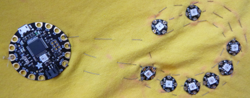

## ನಿಮ್ಮ ಸರ್ಕ್ಯೂಟ್ ಹೊಲಿಯಿರಿ

+ ನಿಮ್ಮ ಎಲ್ಲಾ ನಿಯೋಪಿಕ್ಸೆಲ್‌ಗಳು ಮತ್ತು ಕೆಲವು ಸೀಮೆಸುಣ್ಣ ಅಥವಾ ಒಂದು ಪೆನ್ಸಿಲ್ ಅನ್ನು ಒಟ್ಟುಗೂಡಿಸಿ. ಟಿ-ಶರ್ಟ್ \ (ಅಥವಾ ನಿಮ್ಮ ಪ್ರಾಜೆಕ್ಟನ್ನು ನೀವು ಯಾವ ಬಟ್ಟೆಯಲ್ಲಿ ತಯಾರಿಸುತ್ತಿದ್ದೀರೋ ಅದು \) ಅನ್ನು ಚಪ್ಪಟೆ ಮೇಲ್ಮೈಯಲ್ಲಿಇರಿಸಿ.

+ ನೀವು ಇಷ್ಟಪಡುವ ಆಕಾರಕ್ಕೆ ಪಿಕ್ಸೆಲ್‌ಗಳನ್ನು ಜೋಡಿಸಿ. ನಾನು ನಗುತ್ತಿರುವ ಮುಖ ಮಾಡಲು ಹೊರಟಿದ್ದೇನೆ! ಇತರ ಕೆಲವು ಉಪಾಯಗಳು ಹೀಗಿವೆ:
  + ನೇರ ರೇಖೆ
  + ಹೃದಯ (ಎಂಟು ನಿಯೋಪಿಕ್ಸೆಲ್‌ಗಳು ಇದಕ್ಕಾಗಿ ಸೂಕ್ತವಾಗಿವೆ)
  + ಟಿ-ಶರ್ಟ್ ಮುಂಭಾಗದಲ್ಲಿ ನಟನಾ "ಗುಂಡಿಗಳು"
  + ಯಾದೃಚ್ಛಿಕ ಮಾದರಿ

+ ಫ್ಲೋರಾವನ್ನು ನೀವು ಎಲ್ಲಿ ಇಡಲು ಯೋಜಿಸುತ್ತೀರಿ ಎಂದು ಸ್ಥೂಲವಾಗಿ ನಿರ್ಧರಿಸಿ, ಮತ್ತು ಅದರೊಂದಿಗೆ ಸಂಪರ್ಕ ಹೊಂದಲು ಒಂದು ನಿಯೋಪಿಕ್ಸೆಲ್ ಅನ್ನು ಆರಿಸಿ: ಇದು ನೀವು ಹೊಲಿಯುವ ಮೊದಲನೆಯದು. ಉಳಿದವುಗಳನ್ನು ಒಂದರ ನಂತರ ಇನ್ನೊಂದರಂತೆ ಒಂದು ಸರಪಳಿಯ ರೀತಿಯಲ್ಲಿ ಒಂದಕ್ಕೊಂದು ಸಂಪರ್ಕಿಸಲಾಗುತ್ತದೆ.

+ ನೀವು ನಿಯೋಪಿಕ್ಸೆಲ್‌ಗಳನ್ನು ಹೊಲಿಯುವ ಕ್ರಮಾಂಕವನ್ನು ರೂಪಿಸಿ: ಮೊದಲನೆಯದರಿಂದ ಕೊನೆಯದರವರೆಗೆ ತನ್ನನ್ನೇ ತಾನು ದಾಟದಿರುವಂಥ \(ಇದು ಶಾರ್ಟ್ ಸರ್ಕ್ಯೂಟ್ ನಂತಹ ಸಮಸ್ಯೆಗಳನ್ನುಂಟುಮಾಡುತ್ತದೆ!\) ಒಂದು ನಿರಂತರ ಹಾದಿಯನ್ನು ನಿಮ್ಮ ಬೆರಳಿನ ಮೂಲಕ ಗುರುತಿಸಲು ನಿಮಗೆ ಸಾಧ್ಯವಾಗಬೇಕು.

+ ಪ್ರತಿ ನಿಯೋಪಿಕ್ಸೆಲ್ ಇರುವ ಸ್ಥಳವನ್ನು ಗುರುತಿಸುತ್ತಾ, ಪೆನ್ಸಿಲ್ ಅಥವಾ ಸೀಮೆಸುಣ್ಣದಿಂದ ಈ ಮಾರ್ಗದ ಸುತ್ತಲೂ ಎಳೆಯಿರಿ.

### ಹೊಲಿಗೆಯನ್ನು ಪ್ರಾರಂಭಿಸೋಣ!

+ ನೀವು ಎಲ್ಲವನ್ನೂ ಗುರುತಿಸಿದ ನಂತರ, ಎಲ್ಲಾ ತುಣುಕುಗಳನ್ನು ಬದಿಗಿರಿಸಿ ಮತ್ತು ಒಂದು ಸೂಜಿ ಮತ್ತು ಸ್ವಲ್ಪ ವಾಹಕ ದಾರಗಳನ್ನು ತೆಗೆದುಕೊಳ್ಳಿ. ನಿಮ್ಮ ಪಿಕ್ಸೆಲ್ ಗಳು ಸಾಕಷ್ಟು ಹತ್ತಿರವಾಗಿದ್ದರೆ ಪ್ರಾರಂಭಿಸಲು ಸುಮಾರು 20cm ಸಾಕು. ನಿಮ್ಮಲ್ಲಿ ಕಸೂತಿ ಹೂಪ್ ಇದ್ದರೆ, ಅದನ್ನು ಬಳಸುವುದರಿಂದ ಹೊಲಿಗೆ ತುಂಬಾ ಸುಲಭವಾಗಬಹುದು.

ನೀವು ಮೊದಲಿಗೆ **ಡಾಟಾ** (data) ಸಾಲನ್ನು ಹೊಲಿಯುತ್ತೀರಿ. ನಿಯೋಪಿಕ್ಸೆಲ್‌ಗಳನ್ನು ಯಾವಾಗ ಬೆಳಗಿಸಬೇಕು ಎಂಬಂತಹ ಸೂಚನೆಗಳನ್ನು (ನಿಮ್ಮ ಕೋಡ್!) ಹೊಂದಿರುವ ಥ್ರೆಡ್ ಇದು.

+ ಮುಂದಿನದು ಎಲ್ಲಿ ಎಂದು ಸಣ್ಣ ಬಾಣಗಳು ತೋರಿಸುವ ರೀತಿಯಲ್ಲಿ, ನಿಮ್ಮ ಮೊದಲ ನಿಯೋಪಿಕ್ಸೆಲ್ ಅನ್ನು ಅದರ ಜಾಗದಲ್ಲಿರಿಸಿ. ಮಧ್ಯೆ ಇರುವ ಎಲ್ಇಡಿಯಿಂದ **ದೂರ**ಕ್ಕೆ ತೋರಿಸುವ ಬಾಣವು ಇರುವ ರಂಧ್ರದ ಮೂಲಕ ಹೊಲಿದು ಅದನ್ನು ಬಟ್ಟೆಗೆ ಲಗತ್ತಿಸಿ. ಈ ರಂಧ್ರವು **ಔಟ್‌ಪುಟ್ ಪಿನ್** (output pin) ಆಗಿದೆ.

--- collapse ---
---
title: ರಂಧ್ರಗಳು ಅಥವಾ ಪಿನ್‌ಗಳು?
---

Adafruit Flora, Arduino, ಅಥವಾ Raspberry Pi ನಂತಹ ಬೋರ್ಡ್‌ಗಳಲ್ಲಿ, ನಿಮ್ಮ ವಿದ್ಯುತ್ ಸರ್ಕ್ಯೂಟ್‌ಗೆ ಸಂಪರ್ಕಿಸಲು ನೀವು ಬಳಸುವ ಲೋಹದ ಚಿಕ್ಕ ತುಣುಕುಗಳನ್ನು **ಪಿನ್‌ಗಳು** (pins) ಎಂದು ಕರೆಯಲಾಗುತ್ತದೆ.

**ಧರಿಸಬಹುದಾದ** (wearable) ಎಲೆಕ್ಟ್ರಾನಿಕ್ಸ್ ವಿಷಯದಲ್ಲಿ, ಪಿನ್‌ಗಳು ಪಿನ್ ಆಕಾರದಲ್ಲಿ ಇರುವುದಿಲ್ಲ: ಅವು ರಂಧ್ರದ ಆಕಾರವನ್ನು ಹೊಂದಿರುತ್ತವೆ. ಆದ್ದರಿಂದ ನೀವು ವಾಹಕ ದಾರದೊಂದಿಗೆ ಅವುಗಳನ್ನು ಸಂಪರ್ಕಿಸಬಹುದಾಗಿದೆ. ಇದರ ಅರ್ಥವೇನೆ೦ದರೆ, ಧರಿಸಬಹುದಾದ ಪಾಜೆಕ್ಟ್‌ಗಳಲ್ಲಿ 'ಪಿನ್' ಮತ್ತು 'ಹೋಲ್' ಗಳು ಸಮಾನಾರ್ಥಕವಾಗಿರಬಲ್ಲವು.

--- /collapse ---

+ ರಂಧ್ರದ ಮೂಲಕ ಎರಡು ಅಥವಾ ಮೂರು ಹೊಲಿಗೆಗಳನ್ನು ಬಿಗಿಯಾಗಿ ಹೊಲಿಯುವ ಮೂಲಕ ಸುರಕ್ಷಿತ ಸಂಪರ್ಕವನ್ನು ಮಾಡಲು ಮರೆಯದಿರಿ.

+ ಮುಂದಿನ ನಿಯೋಪಿಕ್ಸೆಲ್ ಇರುವ ಸ್ಥಳಕ್ಕೆ ರನ್ನಿಂಗ್ ಹೊಲಿಗೆಯನ್ನು (running stitch) ಹೊಲಿಯಿರಿ.

+ ನಂತರ ಮುಂದಿನ ಪಿಕ್ಸೆಲ್ ತೆಗೆದುಕೊಂಡು ಅದನ್ನು ಅದರ ಸ್ಥಳಕ್ಕೆ ಇರಿಸಿ. ಬಾಣಗಳು ಮೊದಲನೆಯದರಿಂದ ದೂರಕ್ಕೆ ಹಾಗೂ ಮುಂದಿನ ಸ್ಥಳದ ಕಡೆಗೆ ತೋರಿಸಬೇಕು. **ಇನ್‌ಪುಟ್** (input) ರಂಧ್ರದ ಮೂಲಕ ಹೊಲಿಗೆ ಹಾಕಿ ಅದನ್ನು ಜೋಡಿಸಿ \(ನೆನಪಿಡಿ, ಇದು ಮಧ್ಯದಲ್ಲಿರುವ ಎಲ್ಇಡಿಯ **ಕಡೆಗೆ** ಸೂಚಿಸುವ ಬಾಣವಿರುವ ರಂಧ್ರ\).

+ ಬಟ್ಟೆಯ ಹಿಂಭಾಗದಲ್ಲಿ ಕೆಲವು ಹೊಲಿಗೆಗಳನ್ನು ಹಾಕುವ ಮೂಲಕ ದಾರವನ್ನು ಸುರಕ್ಷಿತಗೊಳಿಸಿ ಮತ್ತು ಉಳಿದಿರುವದನ್ನು ಕತ್ತರಿಸಿ.

--- collapse ---
---
title: ತುದಿಗಳನ್ನು ರಕ್ಷಿಸುವುದು
---

ಕತ್ತರಿಸಿದ ನಂತರ ದಾರವು ಕಿತ್ತುಬರದಂತೆ ಮತ್ತು ಶಾರ್ಟ್ ಸರ್ಕ್ಯೂಟ್ ಮಾಡದಂತೆ ಅದರ ತುದಿಗಳಿಗೆ ತಿಳಿ ಉಗುರು ಬಣ್ಣ (nail polish) ಸವರುವುದು ಉತ್ತಮ.

--- /collapse ---

+ ಒಂದು **ಹೊಸ ವಾಹಕ ದಾರದ ತುಣುಕನ್ನು** ಉಪಯೋಗಿಸಿ, 2ನೇ ನಿಯೋಪಿಕ್ಸೆಲ್‌ನ **ಔಟ್‌ಪುಟ್** ರಂಧ್ರವನ್ನು 3ನೇ ನಿಯೋಪಿಕ್ಸೆಲ್‌ನ </strong>ಇನ್‌ಪುಟ್</0> ರಂಧ್ರಕ್ಕೆ ಸಂಪರ್ಕಿಸಿ. ಈ ರೀತಿಯಾಗಿ, ಎಲ್ಲಾ ನಿಯೋಪಿಕ್ಸೆಲ್‌ಗಳು ಅವುಗಳ **ಡಾಟಾ** ರಂಧ್ರಗಳ ಮೂಲಕ ಒಂದಕ್ಕೊಂದು ಕೊಂಡಿಯಾಗುವ ರೀತಿಯಲ್ಲಿ ಮುಂದುವರೆಸಿ. ಪ್ರತಿ ಜೊತೆಯ ಮಧ್ಯೆಯೂ ಒಂದು ಹೊಸ ದಾರದ ತುಂಡನ್ನು ಉಪಯೋಗಿಸಿ. ಸರಪಳಿಯು ಕೊನೆಯ ನಿಯೋಪಿಕ್ಸೆಲ್‌ನೊಂದಿಗೆ ಕೊನೆಗೊಳ್ಳುತ್ತದೆ: ನೀವು ಅದರ **ಔಟ್‌ಪುಟ್** ರಂಧ್ರಕ್ಕೆ ಏನನ್ನೂ ಲಗತ್ತಿಸುವುದಿಲ್ಲ.

ನಂತರ ನೀವು ಸರಪಳಿಯಲ್ಲಿ ಎಲ್ಲಾ **ಋಣಾತ್ಮಕ** (negative) ರಂಧ್ರಗಳನ್ನು ಸಂಪರ್ಕಿಸುತ್ತೀರಿ, ತದನಂತರ ಎಲ್ಲಾ **ಧನಾತ್ಮಕ** (positive) ರಂಧ್ರಗಳನ್ನು.

+ ಸುಮಾರು 50-100 ಸೆ೦.ಮೀ. ಇರುವ ಒಂದು ಉದ್ದವಾದ ವಾಹಕ ದಾರದ ತುಣುಕನ್ನು ತೆಗೆದುಕೊಂಡು, ಮೊದಲ ಪಿಕ್ಸೆಲ್‌ನಿಂದ ಕೊನೆಯದರವರೆಗೆ, ಪ್ರತಿ ಪಿಕ್ಸೆಲ್‌ನ **-** ರಂಧ್ರದ ಮೂಲಕ ಕೆಲವು ಬಿಗಿ ಹೊಲಿಗೆಗಳನ್ನು ಹೊಲಿಯಿರಿ, ಮತ್ತು ನಿಯೋಪಿಕ್ಸೆಲ್‌ಗಳ ನಡುವೆ ರನ್ನಿಂಗ್ ಹೊಲಿಗೆಯನ್ನು ಹೊಲಿಯಿರಿ.

**ಸೂಚನೆ**: ಈ ದಾರವು **ಡಾಟಾ** ಸಾಲಿನಲ್ಲಿರುವ ಯಾವುದೇ ದಾರಗಳನ್ನು ಮುಟ್ಟದಂತೆ ಮತ್ತು ದಾಟದಂತೆ ನೋಡಿಕೊಳ್ಳಿ!

+ ಇನ್ನೊಂದು ಉದ್ದವಾದ ವಾಹಕ ದಾರದ ತುಂಡಿನೊಂದಿಗೆ, ನೀವು ಈಗಷ್ಟೆ **-** ರಂಧ್ರಗಳನ್ನು ಸಂಪರ್ಕಿಸಿದ ರೀತಿಯಲ್ಲೇ, ಎಲ್ಲಾ ನಿಯೋಪಿಕ್ಸೆಲ್‌ಗಳ **+** ರಂಧ್ರಗಳನ್ನು ಕೂಡಾ ಸಂಪರ್ಕಿಸಿ.

+ ಕೊನೆಯದಾಗಿ, ಫ್ಲೋರಾ ಬೋರ್ಡ್ ಅನ್ನು ಅಂಗಿಯ ಮೇಲೆ ಇಡೀ \(ಅದು **ಸಂಪರ್ಕಿತವಾಗಿಲ್ಲ** ಎಂದು ಖಚಿತಪಡಿಸಿಕೊಂಡ ನಂತರ!\).

+ ಮೂರು **ಪ್ರತ್ಯೇಕ** ವಾಹಕ ದಾರದ ತುಣುಕುಗಳನ್ನು ತೆಗೆದುಕೊಂಡು, ಬೋರ್ಡ್‌ನ **\#6** ರಂಧ್ರವನ್ನು ಪ್ರಥಮ ನಿಯೋಪಿಕ್ಸೆಲ್‌ನ **ಇನ್‌ಪುಟ್** ರಂಧ್ರಕ್ಕೆ, ಬೋರ್ಡ್‌ನ **ಜಿ‌ಎನ್‌ಡಿ** (GND) ರಂಧ್ರವನ್ನು ಪ್ರಥಮ ನಿಯೋಪಿಕ್ಸೆಲ್‌ನ **-** ರಂಧ್ರಕ್ಕೆ, ಹಾಗೂ ಬೋರ್ಡ್‌ನ **ವಿ‌ಬಿ‌ಎ‌ಟಿ‌ಟಿ** (VBATT) ರಂಧ್ರವನ್ನು ಪ್ರಥಮ ನಿಯೋಪಿಕ್ಸೆಲ್‌ನ **+** ರಂಧ್ರಕ್ಕೆ ಸಂಪರ್ಕಿಸಿ. ಬಟ್ಟೆಯ ಉದ್ದಕ್ಕೂ ರನ್ನಿಂಗ್ ಹೊಲಿಗೆಯನ್ನು ಹೊಲಿಯಿರಿ. ಯಾವುದೇ ದಾರಗಳು ಪರಸ್ಪರ ಸ್ಪರ್ಶಿಸದಂತೆ ನೋಡಿಕೊಳ್ಳಿ.

+ ನಿಮಗೆ ಇಷ್ಟವಿದ್ದರೆ, Flora ದಲ್ಲಿ ಬಳಸದ ಕೆಲವು ಪಿನ್ ಗಳನ್ನು ನೀವು ಟಿ-ಶರ್ಟ್ ಗೆ ಸ್ವಲ್ಪ ಸಾದಾ ದಾರದಿಂದ ಹೊಲಿಯಬಹುದು ಮತ್ತು ಅದನ್ನು ಹೆಚ್ಚು ಸುರಕ್ಷಿತವಾಗಿ ಇರಿಸಬಹುದು.

+ ಈಗ, ಸತ್ಯದ ಕ್ಷಣ: ನಿಮ್ಮ ಫ್ಲೋರಾವನ್ನು ಪ್ಲಗ್ ಇನ್ ಮಾಡಿ.

ನಿಮ್ಮ ಎಲ್ಲಾ ನಿಯೋಪಿಕ್ಸೆಲ್‌ಗಳು ಬೆಳಗುತ್ತಿರುವುದನ್ನು ನೀವು ನೋಡಬೇಕು!

--- collapse ---
---
title: ಏನೋ ಸರಿಯಿಲ್ಲ
---

ನಿಮ್ಮ ಕೆಲವು ನಿಯೋಪಿಕ್ಸೆಲ್‌ಗಳು ಬೆಳಗದಿದ್ದರೆ ಕಳವಳಪಡಬೇಡಿ. ಕೆಲವು ಕಾರಣಗಳು ಹೀಗಿರಬಹುದು:

+ ಶಾರ್ಟ್ ಸರ್ಕ್ಯೂಟ್: ಯಾವುದಾದರೂ ದಾರ ಸ್ಪರ್ಷಿಸುತ್ತಿದೆಯೇ? ಬಟ್ಟೆಯ ಮೇಲೆ ಅಥವಾ ಸರ್ಕ್ಯೂಟ್ ಅನ್ನು ಮುಟ್ಟುವಂತೆ ಯಾವುದಾದರೂ ಲೋಹಪದಾರ್ಥ ಇದೆಯೇ? ಬಟ್ಟೆ ಒದ್ದೆಯಾಗಿದೆಯೇ?

+ ಸಡಿಲವಾದ ಸಂಪರ್ಕಗಳು: ಸುರಕ್ಷಿತ ಸಂಪರ್ಕಕ್ಕಾಗಿ ಪ್ರತಿ ರಂಧ್ರದಲ್ಲಿನ ಹೊಲಿಗೆಗಳು ಉತ್ತಮ ಮತ್ತು ಬಿಗಿಯಾಗಿರಬೇಕು.

+ ಸರಿಯಾದ ಕೋಡ್ ಅಪ್‌ಲೋಡ್ ಮಾಡಲಾಗಿದೆ: ನಿಮ್ಮ ಕೋಡ್ ಸರಿಯಾದ ಸಂಖ್ಯೆಯ ನಿಯೋಪಿಕ್ಸೆಲ್‌ಗಳನ್ನು ಹೊಂದಿದೆಯೇ? ಅದು ದೋಷಗಳಿಲ್ಲದೆ ಕಂಪೈಲ್ ಆಗಿ ಅಪ್‌ಲೋಡ್ ಆಗಿದೆಯೇ?

--- /collapse --- 
