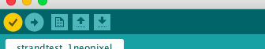

## तुमचा एलईडीची (LED) चाचणी करा

आपण प्रारंभ करण्यापूर्वी, आपल्या प्रत्येक निओपिक्सलची चाचणी घेणे चांगले आहे.

+ Arduino आयडीई चालू करा. **Tools** मेनूमध्ये बरोबर डिव्हाइस निवडलेले पहा. मी फ्लोरा वापरत आहे, अशा प्रकारे माझ्यासाठी **Adafruit Flora** आहे.

+ मेनू मध्ये **File** वर जा, **Examples** निवडा, त्यानंतर **Adafruit NeoPixel** शोधा \(ते अगदी तळाशी असू शकते!\) आणि **strandtest**निवडा.

एक कोड फाईल उघडेल. Arduino आयडीई मध्ये कोड फाईलला **sketch** म्हणतात.

+ शीर्षस्थानाजवळ ही कोडची ओळ शोधा:

```
  Adafruit_NeoPixel strip = Adafruit_NeoPixel(60, PIN, NEO_GRB + NEO_KHZ800);
```

+ प्रथम क्रमांक `1` ला बदला. ओळ आता असा दिसायला हवा:

  ```
    Adafruit_NeoPixel strip = Adafruit_NeoPixel(1, PIN, NEO_GRB + NEO_KHZ800);
  ```

+ **File** क्लिक करा आणि नंतर **Save As...** करा. आपल्या स्केचसाठी नाव टाइप करा आणि **Save** क्लिक करा.

+ आपल्या स्केचच्या शीर्षस्थानी, **verify** टिक आयकॉनवर (चेक मार्क) क्लिक करा. विंडोच्या खाली आपल्याला "Done Compiling" शब्द दिसेल ज्याचा अर्थ कोड यशस्वीरित्या **compile** झाले आहे \(नसल्यास, आपण येथे मुद्रित एर्रोर्स दिसेल. या निराकरणासाठी, आपल्याला काही डीबगिंग करण्याची आणि आपला कोड बदलण्याची आवश्यकता असेल!\).



अपलोड करण्यासाठी तयार!

+ आपल्या फ्लोरा प्लग करा. फ्लोरावरील आहे **reset** बटण दाबा आणि नंतर **तत्क्षणी**, रेड लाइट चालू असताना, तेव्हा बोर्ड वर कोड **upload** करण्यासाठी टिक / चेक मार्कच्या पुढील बाण चिन्हावर क्लिक करा.

+ आपल्याला रेड लाइट फ्लॅशिंग दिसले पाहिजे, त्यानंतर बोर्डवर दोन नारिंगी दिवे असतील. हे पूर्ण झाल्यावर आपण "Done uploading" शब्द आपल्या रेखाटनेच्या तळाशी अवश्य दिसणे.


--- collapse ---
---
title: अपलोड करण्यात समस्या
---

सुरुवातीला अपलोडवर काम करणे थोडे अवघड असू शकते. योग्य बोर्ड निवडलेले असल्याची आणि आपल्याकडे दोन्ही टोकांवर योग्यरित्या प्लग केलेले एक कार्यरत यूएसबी केबल असल्याचे सुनिश्चित करा. यानंतर, हे सर्व वेळेचे खेळ आहे! आपल्याला त्याची सवय होईल.

--- /collapse ---

+ आपल्या कॉम्प्युटरवरून फ्लोरा अनप्लग करा \(आपण बॅटरी पॅक वापरत असताना आपण फ्लोरावरील पॉवर स्विच बंद करण्यासाठी वापरू शकता, परंतु जेव्हा यूएसबी द्वारा बोर्ड कॉम्पुटरात प्लग इन केले आहे ते काम करत नाही\).

**इतर घटक कनेक्ट करण्यापूर्वी किंवा डिस्कनेक्ट करण्यापूर्वी बोर्ड नेहमीच अनप्लग करणे किंवा बोर्ड बंद करणे महत्वाचे आहे जेणेकरून आपण त्यांचे नुकसान होऊ नये!**

+ तीन क्रोकोडैल क्लिप्स **GND**, **#6** बोर्डस ला आणि **VBATT** पिन्स ला जोडा.


+ एक निओपिक्सल घ्या आणि **GND** बोर्डाच्या वायरला **-** पिन जोडा. **#6** बोर्ड ची पिन **data in** पिन ला जोडा. हे एर्रोव सह पिन आहे जे दर्शवित आहे **in towards** मध्यभागी एलईडी दिशेने. शेवटी, **VBATT** बोर्ड **+** पिन ला जोडा.


+ तयार? पुन्हा एकदा फ्लोरा प्लग इन करा आणि आपली एलईडी दिवे सुरू केलेला पहा आणि एक बहुरंगी क्रम फ्लॅश करा!

+ जसे आपण नुकतेच आपल्या पहिल्यासह केले आहे त्यांना फ्लोराशी जोडून, आपल्या प्रत्येक निओपिक्सल्स चा एक एक करून त्याची चाचणी घ्या. तार जोडण्यापूर्वी किंवा डिस्कनेक्ट करण्यापूर्वी **फ्लोरा अनप्लग** करण्यासाठी लक्षात ठेवा !

+ एकदा आपण निओपिक्सल्सची चाचणी पूर्ण केल्यावर आपण वापरत असलेल्या एकूण निओपिक्सल्स च्या संख्येत कोड पुन्हा बदला. माझे आठ आहे:

```
  Adafruit_NeoPixel strip = Adafruit_NeoPixel(8, PIN, NEO_GRB + NEO_KHZ800);
```

+ **Verify** क्लिक करा आणि त्यानंतर **upload** वर क्लिक करुन नवीन कोड फ्लोरा वर अपलोड करा. पुढे आपण आपले निओपिक्सल सर्किट बनवणार आहात!
