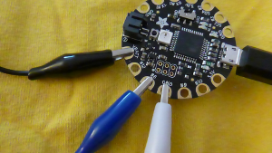
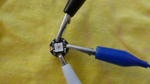

## Test de LED's

Voordat je begint, is het een goed idee om elk van je NeoPixels te testen.

+ Open de Arduino IDE. Zorg ervoor dat het juiste apparaat is geselecteerd in het menu **Hulpmiddelen**. Ik gebruik de Flora, dus voor mij is het **Adafruit Flora**.

+ Ga naar het **Bestand** menu, selecteer **Voorbeelden**, zoek vervolgens **Adafruit NeoPixel** \(het kan helemaal onderaan staan!\) en kies **strandtest**.

Er wordt een codebestand geopend. Een codebestand heet een **schets** in de Arduino IDE.

+ Zoek deze regel met code bijna bovenaan:

```
  Adafruit_NeoPixel strip = Adafruit_NeoPixel(60, PIN, NEO_GRB + NEO_KHZ800);
```

+ Wijzig het eerste getal in `1`. De regel zou er nu als volgt uit moeten zien:

  ```
    Adafruit_NeoPixel strip = Adafruit_NeoPixel(1, PIN, NEO_GRB + NEO_KHZ800);
  ```

+ Klik op **Bestand** en vervolgens op **Opslaan als...**. Typ een naam voor de schets en klik op **Opslaan**.

+ Klik boven aan je schets op het vinkje-pictogram om de code **te verifiëren**. Onder aan het venster zou je de woorden "Compileren voltooid" moeten zien, wat betekent dat de code succesvol **gecompileerd** is \(zo niet, dan zie je hier fouten. Om deze op te lossen, moet je wat foutopsporing doen en je code wijzigen!\).


Klaar om te uploaden!

+ Sluit je Flora aan. Druk op de **reset** knop op de Flora en **meteen**, terwijl het rode lampje knippert, klik op het pijlpictogram naast het vinkje om de code naar het bord te **uploaden**.

+ Je zou het rode lampje moeten zien knipperen, gevolgd door twee oranje lampjes op het bord. Wanneer het klaar is, zou je de woorden "klaar met uploaden." moeten zien onderaan je schets.


--- collapse ---
---
title: Problemen met uploaden
---

In eerste instantie kan het een beetje lastig zijn om het uploaden te laten werken. Zorg ervoor dat het juiste bord is geselecteerd en dat je een werkende USB-kabel hebt die aan beide uiteinden goed is aangesloten. Daarna draait het allemaal om timing! Je zult het onder de knie krijgen.

--- /collapse ---

+ Koppel de Flora los van de computer \(je kunt de aan/uit-schakelaar op een Flora gebruiken om deze uit te schakelen wanneer je een accu-eenheid gebruikt, maar het werkt niet wanneer de kaart via USB op een computer is aangesloten\).

**Het is belangrijk om altijd het bord los te koppelen of uit te schakelen voordat je andere onderdelen aansluit of loskoppelt, zodat je ze niet beschadigt!**

+ Bevestig drie krokodillenklemmen aan de **GND**-, **\#6**- en **VBATT**-pinnen van het bord.



+ Neem een NeoPixel en verbind de **GND** draad van het bord met de **-** pin. Verbind de **\#6** pin van het bord met de **data in** pin: Dit is de pin met een pijl die **naar binnen wijst naar** in de richting van de LED in het midden. Sluit ten slotte de **VBATT** van het bord aan op de **+** pin.



+ Klaar? Sluit de Flora weer aan en kijk hoe je LED gaat branden en een veelkleurige reeks gaat knipperen!

+ Test elk van je andere NeoPixels een voor een door ze op de Flora aan te sluiten zoals je net gedaan hebt met je eerste. Vergeet niet **de Flora los te koppelen** voordat je draden aansluit of loskoppelt!

+ Als je klaar bent met het testen van de NeoPixels, wijzig dan de code opnieuw in het totale aantal NeoPixels dat je gaat gebruiken. Ik heb er acht:

```
  Adafruit_NeoPixel strip = Adafruit_NeoPixel(8, PIN, NEO_GRB + NEO_KHZ800);
```

+ Klik op **verifiëren** en **upload** de nieuwe code naar de Flora. Vervolgens ga je je NeoPixel circuit maken!
