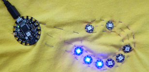

## Schrijf je eigen code

+ Klik in Arduino IDE op **Bestand** en vervolgens op **Nieuw**. Je krijgt een lege **schets** die er als volgt uitziet:
```
    void setup() {
        // put your setup code here, to run once:

    }
    void loop() {
        // put your main code here, to run repeatedly:

    }
```

--- collapse ---
---
title: Notities maken in je code
---

Elke regel die begint met `//` is een **opmerking**. Opmerkingen worden genegeerd door de computer.

Ze zijn handig voor het maken van notities voor jezelf, of voor andere mensen die je code willen!

--- /collapse ---

+ Ga naar **Schets** en **Bibliotheek gebruiken**, en selecteer **Adafruit NeoPixel**. Je zou moeten zien dat deze code wordt toegevoegd aan de bovenkant van je schets: `#include <Adafruit_NeoPixel.h>`.

+ Klik aan het einde van de regel en druk een paar keer op de <kbd>Enter</kbd> toets om een paar lege regels eronder toe te voegen.

+ Typ onder de nieuwe regel code het volgende: `#define PIXELS_PIN 6`

Met deze code stel je in welke pin (hetzelfde als een gat hier) van de Flora gebruikt moet worden voor **data** \(instructies\). Dus de pin waar je de **data** gaten van de NeoPixels aan verbindt is nummer **6**.

+ Typ `#define NUM_PIXELS 8` hieronder. Dit is het aantal NeoPixels dat je hebt. Als je een ander getal dan acht hebt, typ dan dat nummer in plaats van `8`.

+ Typ ten slotte hieronder:

``` 
    Adafruit_NeoPixel strip = Adafruit_NeoPixel(NUM_PIXELS, PIXELS_PIN, NEO_GRB + NEO_KHZ800);
```

+ Voeg binnen de `setup` functie de volgende twee regels toe:

``` 
    void setup() {
        // put your setup code here, to run once:
        strip.begin();
        strip.show();
    }
```

--- collapse ---
---
title: Wat is de setup-functie?
---

De code `void setup ()` definieert de `setup` functie. Dit is een codeblok dat wordt uitgevoerd wanneer de Flora wordt ingeschakeld.

Alle code tussen de accolades `{` en `}` is binnen de functie en zal ook worden uitgevoerd wanneer de Flora wordt ingeschakeld.

--- /collapse ---

+ Druk na `strip.show();` op <kbd>Enter</kbd> en typ deze twee regels hieronder:

``` 
    strip.setPixelColor(0, strip.Color(0, 0, 255));
    strip.show();
```

+ Klik op **verifiëren** om je code te compileren en op fouten te controleren. Als er fouten zijn, moet je de code repareren en opnieuw controleren. Meestal vertellen de foutmeldingen je welke regel code moet worden hersteld. Controleer of je het precies hebt getypt zoals weergegeven!

+ Laten we de Flora aansluiten en je code uitvoeren! Druk op de **reset** knop op de Flora en druk vervolgens op de **Upload** knop. Wat gebeurt er als het klaar is?

Je zou het eerste NeoPixel blauw moeten zien oplichten.

+ Laten we er nog een doen! **Boven** de tweede `strip.show();`, typ nog twee regels:

```
    strip.setPixelColor(1, strip.Color(0, 0, 255));
    strip.setPixelColor(2, strip.Color(0, 0, 255));
```

De `setup` functie zou er nu als volgt uit moeten zien:

``` 
    void setup() {
        // put your setup code here, to run once:
        strip.begin();
        strip.show();
        strip.setPixelColor(0, strip.Color(0, 0, 255));
        strip.setPixelColor(1, strip.Color(0, 0, 255));
        strip.setPixelColor(2, strip.Color(0, 0, 255));
        strip.show();
    }
```

Kun je uitzoeken wat een deel van deze code doet?

+ Controleer en upload je code opnieuw. Deze keer zou je de eerste drie NeoPixels blauw moeten zien oplichten.

+ Kijk of je meer regels code kunt toevoegen om de rest van de pixels ook te laten oplichten!




